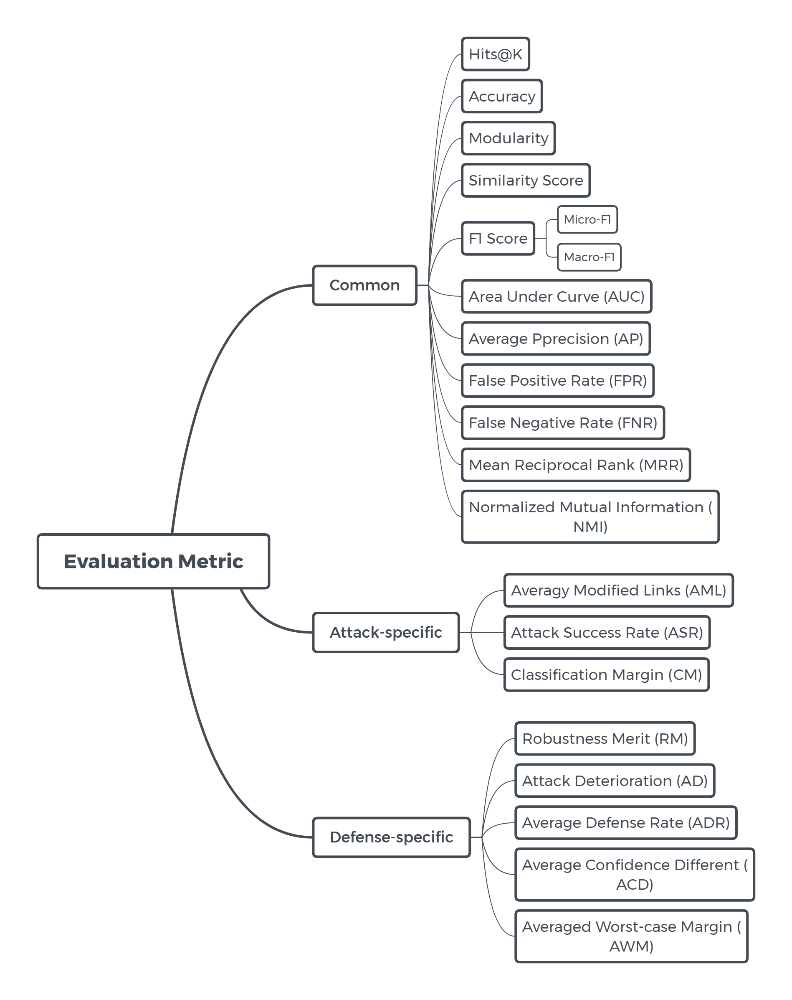

# Table of Contents
+ [Attack](#attack)
    + [1] [Adversarial attacks on graph neural networks via meta learning](#1)
    + [2] [Adversarial Attacks on Node Embeddings via Graph Poisoning](#2)
    + [3] [Attacking Graph Convolutional Networks via Rewiring](#3)
    + [4] [Topology Attack and Defense for Graph Neural Networks: An Optimization Perspective](#4)
    + [5] [Unsupervised Euclidean Distance Attack on Network Embedding](#5)
    + [6] [Generalizable Adversarial Attacks Using Generative Models](#6)
    + [7] [Data Poisoning Attack against Knowledge Graph Embedding](#7)
    + [8] [Attacking Graph-based Classification via Manipulating the Graph Structure](#8)
    + [9] [GA Based Q-Attack on Community Detection](#9)
    + [10] [Attack Graph Convolutional Networks by Adding Fake Nodes](#10)
    + [11] [Attack Tolerance of Link Prediction Algorithms: How to Hide Your Relations in a Social Network](#11)
    + [12] [Link Prediction Adversarial Attack](#12)
    + [13] [Adversarial Attack on Graph Structured Data](#13)
    + [14] [Adversarial Attacks on Neural Networks for Graph Data](#14)
    + [15] [Fast Gradient Attack on Network Embedding](#15)
    + [16] [Data Poisoning Attack against Unsupervised Node Embedding Methods](#16)
    + [17] [Attacking Similarity-Based Link Prediction in Social Networks](#17)
    + [18] [Practical Attacks Against Graph-based Clustering](#18)

- [Defense](#defense)
    - [1] [Certifiable Robustness and Robust Training for Graph Convolutional Networks](#101)
    - [2] [Topology Attack and Defense for Graph Neural Networks: An Optimization Perspective](#102)
    - [3] [Power up! Robust Graph Convolutional Network against Evasion Attacks based on Graph Powering](#103)
    - [4] [Adversarial Examples on Graph Data: Deep Insights into Attack and Defense](#104)
    - [5] [Adversarial Defense Framework for Graph Neural Network](#105)
    - [6] [Investigating Robustness and Interpretability of Link Prediction via Adversarial Modifications](#106)
    - [7] [Robust Graph Convolutional Networks Against Adversarial Attacks](#107)
    - [8] [Can Adversarial Network Attack be Defended?](#108)
    - [9] [Virtual Adversarial Training on Graph Convolutional Networks in Node Classification](#109)
    - [10] [Comparing and Detecting Adversarial Attacks for Graph Deep Learning](#110)
    - [11] [Graph Adversarial Training: Dynamically Regularizing Based on Graph Structure](#111)
    - [12] [Characterizing Malicious Edges targeting on Graph Neural Networks](#112)
    - [13] [Batch Virtual Adversarial Training for Graph Convolutional Networks](#113)
    
- [Baselines](#Baselines)

- [Metric](#Metric)

# Attack
|Venue|Title|Model|Algorithm|Attack Type|Target Task|Target Model|Baseline|Metric\*|Dataset|Code|
|:-:|:-:|:-:|:-:|:-:|:-:|:-:|:-:|:-:|:-:|:-:|
|ICLR 2019|[[1]](https://arxiv.org/abs/1902.08412) [🔙](#toc)|Meta-Self Meta-Train|Meta Gradient based on GCN|placeholder|Node Classification|GCN CLN DeepWalk|DICE NETTACK First-order|Misclassification Rate |Cora CiteSeer PolBlogs|[Link](https://www.kdd.in.tum.de/research/gnn-meta-attack/)|
|ICML 2019|[[2]](https://arxiv.org/abs/1809.01093) [🔙](#toc)| |Gradient based on random walk|placeholder|Node Classification Link Prediction|DeepWalk|  |F1 Score  Classification Margin |Cora Citeseer PolBlogs|[Link](https://www.kdd.in.tum.de/research/node_embedding_attack/)
|Arxiv 2019|[[3]](https://arxiv.org/abs/1906.03750) [🔙](#toc)|ReWatt|Reinforcement learning based on GCN|placeholder|Graph Classification|GCN|RL-S2V RA RA-S|ASR |REDDIT-MULTI-12K REDDIT-MULTI-5K IMDB-MULTI|-|
|IJCAI 2019|[[4]](https://arxiv.org/abs/1906.04214) [🔙](#toc)|PGD Min-Max|Gradient based|Poision Topology W & B -box|Node Classification|GCN|DICE Meta-Self Greedy|Misclassification Rate |Cora Citeseer|[Link](https://github.com/KaidiXu/GCN_ADV_Train)|
|Arxiv 2019|[[5]](https://arxiv.org/abs/1905.11015) [🔙](#toc)|EDA|Genetic algorithm based on DeepWalk|placeholder|Node Classification Community Detection|HOPE LPA EM DeepWalk|RA DICE RLS DBA|NMI Micro-F1 Macro-F1|Karate Game Dolphin|-|
|Arxiv 2019|[[6]](https://arxiv.org/abs/1905.10864) [🔙](#toc)|DAGAER|Generative model based on VGAE|Evasion Feature White-box|Node Classification|GCN|NETTACK|ASR |Cora CiteSeer|-|
|Arxiv 2019|[[7]](https://arxiv.org/abs/1904.12052) [🔙](#toc)|-|Knowledge embedding|placeholder|Fact Plausibility Prediction|TransE TransR RESCAL|RA|MRR HR@10|FB15k WN18|-|
|Arxiv 2019|[[8]](https://arxiv.org/abs/1903.00553) [🔙](#toc)|-|Based on LinLBP|placeholder|Node Classification Detection Evade|LinLBP JWP LBP RW LINE DeepWalk Node2vec GCN|RA NETTACK|FNR  FPR |Facebook Enron Epinions Twitter Google+|-|
|TCSS 2019|[[9]](https://arxiv.org/abs/1811.00430) [🔙](#toc)|Q-Attack|Genetic algorithm|placeholder|Community Detection|FN Lou SOA LPA INF Node2vec+KM|RA CDA DBA|Modularity Q NMI|Karate Dolphins Football Polbooks|-|
|Arxiv 2018|[[10]](https://arxiv.org/abs/1810.10751) [🔙](#toc)|Greedy Greedy GAN|Gradient based on GCN, GAN|placeholder|Node Classification|GCN|RA|Accuracy F1 Score ASR |Cora CiteSeer|-
|Arxiv 2018|[[11]](https://arxiv.org/abs/1809.00152) [🔙](#toc)|CTR OTC|Neighbour score based on graph structure|placeholder|Link Prediction|Traditional Link Prediction Algs|-|AUC AP|WTC 9/11 ScaleFree Facebook Randomly-generated|-|
|Arxiv 2018|[[12]](https://arxiv.org/abs/1810.01110) [🔙](#toc)|IGA|Gradient based on GAE|Evasion Topology W & B -box|Link Prediction|GAE DeepWalk Node2vec CN RA Katz LRW|RAN DICE GA|ASR  AML|NS Yeast FaceBook|-|
|ICML 2018|[[13]](https://arxiv.org/abs/1806.02371) [🔙](#toc)|RL-S2V|Reinforcement Learning|placeholder|Node/Graph Classification|GCN GNN|Random Sampling|Accuracy|Citeseer Cora Pubmed Finance|[Link](https://github.com/Hanjun-Dai/graph_adversarial_attack)
|KDD 2018|[[14]](https://arxiv.org/abs/1805.07984) [🔙](#toc)|Nettack|Based on GCN|Evasion Poision Topology Feature W & B -box|Node Classification|GCN CLN DeepWalk|Rnd FGSM|Classification Margin Accuracy|Cora-ML CiteSeer PolBlogs|[Link](https://github.com/danielzuegner/nettack)|
|Arxiv 2018|[[15]](https://arxiv.org/abs/1809.02797) [🔙](#toc)|FGA|Gradient based on GCN|placeholder|Node Classification Community Detection|GCN GraRep DeepWalk Node2vec LINE GraphGAN|RA DICE NETTACK|ASR  AML|Cora CiteSeer PolBlogs|-|
|Arxiv 2018|[[16]](https://arxiv.org/abs/1810.12881) [🔙](#toc)|Opt-attack|Gradient based on DeepWalk, LINE|placeholder|Link Prediction|DeepWalk LINE Node2vec SC GAE|RA PageRank Degree sum Shortest path|Similarity Score  AP|Facebook Cora Citeseer|-|
|Arxiv 2018|[[17]](https://arxiv.org/abs/1809.08368) [🔙](#toc)|Approx-Local|Similarity methods|placeholder|Link Prediction|Local&Global similarity metrics|RandomDel GreedyBase|Katz Similarity ACT Distance Similarity Score|scale-free Facebook|-|
|CCS 2017|[[18]](https://arxiv.org/abs/1708.09056) [🔙](#toc)|Targeted noise injection -- Small community attack|Noise injection|placeholder|Graph Clustering Community Detection|SVD Node2vec Community Detection Algs|-|ASR FPR |Reverse Engineered DGA Domains NXDOMAIN|-|

# Defense

| Venue| Title | Model | Algorithm | Defense Type | Target Task | Target Model | Baseline | Metric | Dataset | Code | 
|:-:|:-:|:-:|:-:|:-:|:-:|:-:|:-:|:-:|:-:|:-:|
| KDD 2019 |  [[1]](https://arxiv.org/abs/1906.12269) [🔙](#toc) | GNN (trained with RH-U) | Robustness Certification, Robust Training | Robust Training | Node Classification | GNN, GCN | GNN (trained with CE, RCE, RH) | Accuracy, Averaged worst-case Margin | Citeseer, Cora-ML, Pubmed | [Link](https://www.kdd.in.tum.de/research/robust-gcn/) |
| IJCAI 2019 |  [[2]](https://arxiv.org/abs/1906.04214) [🔙](#toc) | - | Robust Training | Robust Training | Node Classification | GCN | GCN | Misclassification Rate  Accuracy | Cora, Citeseer | [Link](https://github.com/KaidiXu/GCN_ADV_Train) |
| Arxiv 2019 |  [[3]](https://arxiv.org/abs/1905.10029) [🔙](#toc) | r-GCN, VPN | Graph Powering | Robust Training | Node Classification | GCN | ManiReg, SemiEmb, LP, DeepWalk, ICA, Planetoid, Vanilla GCN | Accuracy, Robustness Merit, Attack Deterioration | Citeseer, Cora, Pubmed | - |
| IJCAI 2019 |  [[4]](https://arxiv.org/abs/1903.01610) [🔙](#toc) | - | Drop Edges | Pre-processing | Node Classification | GCN | GCN | Classfication Margin, Accuracy | Cora-ML, Citeseer, Polblogs | [Link](https://github.com/stellargraph/stellargraph/) |
| Arxiv 2019 |  [[5]](https://arxiv.org/abs/1905.03679) [🔙](#toc) | DefNet | GAN, GER, ACL | Structure Based | Node Classification | GCN, GraphSAGE | GCN, GraphSage | Classfication Margin | Cora, Citeseer, Polblogs | - |
| Arxiv 2019 |  [[6]](https://arxiv.org/abs/1905.00563) [🔙](#toc) | CRIAGE | Adversarial Modification | Robustness Evaluation | Link Prediction | Knowledge Graph Embedding | DistMult, ConvE | Hits@K, MRR | Nations, Kinship, WN18, YAGO3-10 | - |
| KDD 2019 |  [[7]](http://pengcui.thumedialab.com/papers/RGCN.pdf) [🔙](#toc) | RGCN | Gaussian-based Graph Convolution | Structure Based | Node Classification | GCN | GCN, GAT | Accuracy | Cora, Citeseer, Pubmed | - |
| Arxiv 2019 |  [[8]](https://arxiv.org/abs/1903.05994) [🔙](#toc) | Global-AT, Target-AT, SD, SCEL | Adversarial Training, Smooth Defense | Hybrid | Node Classification | GCN, DeepWalk, node2vec, Louvain | AT | ADR, ACD | PoLBlogs, Cora, Citeseer | - |
| Arxiv 2019 |  [[9]](https://arxiv.org/abs/1902.11045) [🔙](#toc) | SVAT, DVAT | Virtual Adversarial Training | Adversarial Training | Node Classification | GCN | GCN | Accuracy | Cora, Citeseer, Pubmed | - |
| RLGM@ICLR 2019 |  [[10]](https://rlgm.github.io/papers/57.pdf) [🔙](#toc) | - | KL Divergence | Structure Based | Node Classification | GCN, GAT, Nettack | GCN, BGCN, GAT | Classfication Margin, Accuracy, ROC, AUC | Cora, Citeseer, Polblogs | - |
| Arxiv 2019 |  [[11]](https://arxiv.org/abs/1902.08226) [🔙](#toc) | GCN-GATV | Graph Adversarial Training, Virtual Adversarial Training | Adversarial Training | Node Classification | GCN | LP, DeepWalk, SemiEmb, Planetoid, GCN, GraphSGAN | Accuracy | Citeseer, Cora, NELL | - |
| OpenReview 2018 |  [[12]](https://openreview.net/forum?id=HJxdAoCcYX) [🔙](#toc) | SL, OD, GGD, LP+GGD, ENS | Link Prediction, Subsampling, Neighbour Analysis| Hybrid | Link Prediction | GNN, GCN | LP | AUC | Cora, Citeseer | - |
| ICML 2019 |  [[13]](https://arxiv.org/abs/1902.09192) [🔙](#toc) | S-BVAT, O-BVAT | Batch Virtual Adversarial Training | Adversarial Training | Node Classification | GCN | ManiReg, SemiEmb, LP, DeepWalk, Planetoid, Monet, GAT, GPNN, GCN, VAT | Accuracy | Cora, Citeseer, Pubmed, Nell | [Link](https://github.com/thudzj/BVAT) |

# Baselines
| Baseline | Venue | Paper | Code |
|:-:|:-:|:-:|:-:|
| DICE | Nature Human Behaviour 2018 | [Hiding Individuals and Communities in a Social Network](https://arxiv.org/abs/1608.00375) | [Link](https://github.com/JHL-HUST/HiCode) |
| Nettack | KDD 2018 | [Adversarial Attacks on Neural Networks for Graph Data](https://arxiv.org/abs/1805.07984) | [Link](https://github.com/danielzuegner/nettack) |
| First-order | ICML 2017 | [Model-Agnostic Meta-Learning for Fast Adaptation of Deep Networks](https://arxiv.org/abs/1703.03400) | [Link](https://github.com/cbfinn/maml) |
| RL-S2V | ICML 2018 | [Adversarial Attack on Graph Structured Data](https://arxiv.org/abs/1806.02371) | [Link](https://github.com/Hanjun-Dai/graph_adversarial_attack) |
| Meta-Self | ICLR 2019 | [Adversarial Attacks on Graph Neural Networks via Meta Learning](https://arxiv.org/abs/1902.08412) | [Link](https://github.com/danielzuegner/gnn-meta-attack) |
| Greedy | ICLR 2019 | [Adversarial Attacks on Graph Neural Networks via Meta Learning](https://arxiv.org/abs/1902.08412) | [Link](https://github.com/danielzuegner/gnn-meta-attack) |
| DBA | IEEE Transactions 2019 | [GA Based Q-Attack on Community Detection](https://arxiv.org/abs/1811.00430) | - |
| CDA | IEEE Transactions 2019 | [GA Based Q-Attack on Community Detection](https://arxiv.org/abs/1811.00430) | - |
| GA (Gradient based)|  ECML PKDD 2013 | [Evasion Attacks Against Machine Learning at Test Time](https://arxiv.org/abs/1708.06131) | [Link](https://github.com/bethgelab/foolbox/blob/master/foolbox/attacks/gradient.py) |
| FGSM | ICLR 2015 | [Explaining and Harnessing Adversarial Examples](https://arxiv.org/abs/1412.6572) | [Link](https://github.com/1Konny/FGSM) |
| PageRank | VLDB 2010 | [Fast Incremental and Personalized PageRank](https://arxiv.org/abs/1006.2880) | [Link](https://github.com/alexander-stannat/Incremental-Pagerank) |
| GNN | IEEE Transactions 2009 | [The Graph Neural Network Model](https://arxiv.org/abs/1412.6572v3) | [Link](https://github.com/SeongokRyu/Graph-neural-networks) |
| GCN | ICLR 2017 | [Semi-Supervised Classification with Graph Convolutional Networks](https://arxiv.org/abs/1609.02907) | [Link](https://github.com/tkipf/gcn) |
| ManiReg | JMLR 2006 | [Manifold Regularization: A Geometric Framework for Learning from Labeled and Unlabeled Examples](http://www.jmlr.org/papers/v7/belkin06a.html) | [Link](https://github.com/snehchav/Semi-Supervised-Image-Classification) |
| SemiEmb | ICML 2008 | [Deep Learning via Semi-supervised Embedding](https://link.springer.com/chapter/10.1007/978-3-642-35289-8_34) | [Link](https://github.com/yangminz/Semi-supervised_Embedding) |
| LP | ICML 2003 | [Semi-Supervised Learning Using Gaussian Fields and Harmonic Functions](https://www.semanticscholar.org/paper/Semi-Supervised-Learning-Using-Gaussian-Fields-and-Zhu-Ghahramani/02485a373142312c354b79552b3d326913eaf86d) | - |
| Deepwalk | KDD 2014 | [DeepWalk: Online Learning of Social Representations](https://arxiv.org/abs/1403.6652) | [Link](https://github.com/phanein/deepwalk) |
| ICA | ICML 2003 | [Link-based classification](https://link.springer.com/chapter/10.1007/1-84628-284-5_7) | [Link](https://github.com/tkipf/ica) |
| Planetoid | ICML 2016 | [Revisiting Semi-Supervised Learning with Graph Embeddings](https://arxiv.org/abs/1603.08861) | [Link](https://github.com/kimiyoung/planetoid) |
| GraphSage | NIPS 2017 | [Inductive Representation Learning on Large Graphs](https://arxiv.org/abs/1706.02216) | [Link](https://github.com/williamleif/GraphSAGE) |
| DistMult | ICLR 2015 | [Embedding Entities and Relations for Learning and Inference in Knowledge Bases](https://arxiv.org/abs/1412.6575) | [Link](https://github.com/mana-ysh/knowledge-graph-embeddings) |
| ConvE | AAAI 2018 | [Convolutional 2D Knowledge Graph Embeddings](https://arxiv.org/abs/1707.01476) | [Link](https://github.com/TimDettmers/ConvE) |
| GAT | ICLR 2018 | [Graph Attention Networks](https://arxiv.org/abs/1710.10903) | [Link](https://github.com/PetarV-/GAT) |
| AT | ICLR 2015 | [Explaining and Harnessing Adversarial Examples](https://arxiv.org/abs/1412.6572) | [Link](https://github.com/tensorflow/cleverhans) |
| BGCN | AAAI 2019 | [Bayesian graph convolutional neural networks for semi-supervised classification](https://arxiv.org/abs/1811.11103) | - |
| GraphSGAN | ACM 2018 | [Semi-supervised Learning on Graphs with Generative Adversarial Nets](https://arxiv.org/abs/1809.00130) | [Link](https://github.com/THUDM/GraphSGAN) |
| Monet | CVPR 2017 | [Geometric deep learning on graphs and manifolds using mixture model CNNs](https://arxiv.org/abs/1611.08402) | [Link](https://github.com/pierrebaque/GeometricConvolutionsBench) |
| GPNN | CVPR 2018 | [Graph Partition Neural Networks for Semi-Supervised Classification](https://arxiv.org/abs/1803.06272) | [Link](https://github.com/microsoft/graph-partition-neural-network-samples) |
| VAT | IEEE Transactions 2018 | [Virtual Adversarial Training: A Regularization Method for Supervised and Semi-Supervised Learning](https://arxiv.org/abs/1704.03976) | [Link](https://github.com/takerum/vat_tf) |

# Metric

| Metric | Formulation | Description | Venue |
|:-:|:-:|:-:|:-:|
|ACD|||
|Accuracy|||
|ADR|||
|Attack Success Rate (ASR)|||
|Averagy Modified Links (AML)|||
|Average Precision (AP)|||
|Averaged worst-case Margin|||
|Area Under Curve (AUC)|||
|Classification Margin|||
|F1 Score|||
|False Positive Rate (FPR)|||
|False Negative Rate (FNR)|||
|Hit Rate (HR)|||
|Misclassification Rate|||
|Modularity Q|||
|MPR|||
|Precision||
|Normalized Mutual Information (NMI)|||
|Recall||
|Similarity Score|||
