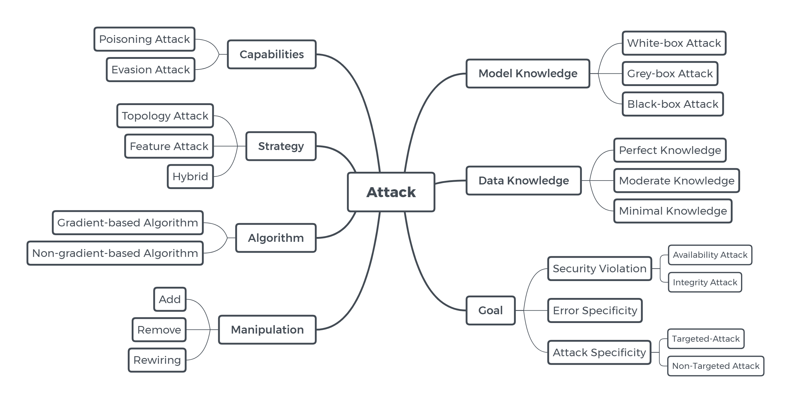
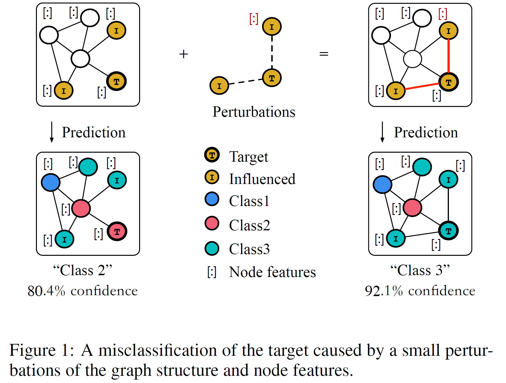
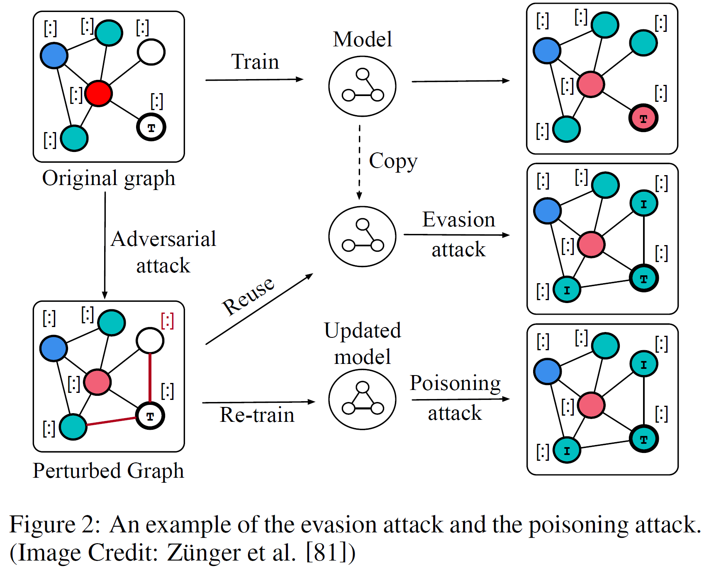

<a class="toc" id="table-of-contents"></a>

# Graph Adversarial Learning (Updating)
+ [Attack](#1)
	+ [2020](#1-1)
	+ [2019](#1-2)
	+ [2018](#1-3)
	+ [2017](#1-4)
+ [Attack types](#2)
+ [Defense](#3)
	+ [2020](#3-1)
	+ [2019](#3-2)
	+ [2018](#3-3)
	+ [2017](#3-4)
+ [Survey](#4)
+ [Resource](#5)
+ [Toolbox](#6)
+ [Cite](#7)


We strongly recommend you to use this Chrome extension [[Widescreen for GitHub]](https://chrome.google.com/webstore/detail/widescreen-for-github/elikdceclccjilahimjfceoalhdbndan?utm_source=chrome-ntp-icon) to have a better view on the tables in this repo.

<a class="toc" id ="1"></a>

# Attack
[🔙](#table-of-contents)

<a class="toc" id ="1-1"></a>
## 2020

|Ref.|Title|Model|Algorithm|Surrogate|Target Task|Target Model|Baseline|Metric|Dataset|
|:-:|:-:|:-:|:-:|:-:|:-:|:-:|:-:|:-:|:-:|
|[WWW](https://arxiv.org/abs/2001.07933)<br>[🔥Code](https://github.com/halimiqi/CD-ATTACK)|Adversarial Attack on Community Detection by Hiding Individuals|CD-ATTACK|Graph generation|GCN|Community Detection|GCN,<br>Node2vec + K-means,<br>ComE|DICE, MBA, RTA|Hiding performance measure M1 & M2|DBLP,<br>Finance|
|[AAMAS](https://arxiv.org/abs/1910.11529)|Manipulating Node Similarity Measures in Networks|FPTA|-|-|Node Similarity|Node Similarity Measures|Random, Greedy,<br> High Jaccard Similarity (HJ)|Time|Barabasi-Albert (BA),<br>Erdos-Renyi (ER)|
|[AAAI](https://arxiv.org/abs/1908.01297)<br>[🔥Code](https://github.com/SwiftieH/GFAttack)|A Restricted Black-box Adversarial Framework Towards Attacking Graph Embedding Models|GF-Attack|Graph signal processing|-|Node Classification|GCN, SGC,<br>DeepWalk,<br>LINE|Random,<br>Degree,<br>RL-S2V, |Accuracy|Cora,<br>CiteSeer,<br>Pubmed|
|[BigData](https://arxiv.org/abs/2002.08012)|Indirect Adversarial Attacks via Poisoning Neighbors for Graph Convolutional Networks|POISONPROBE|Binary search|GCN|Node Classification|GCN|Nettack|ASR, Recall|Citeseer, Cora-ML|
|[KDD]|Certifiable Robustness of Graph Convolutional Networks under Structure Perturbation|Model|Algorithm|Surrogate|Target Task|Target Model|Baseline|Metric|Dataset|
|[WWW](http://faculty.ist.psu.edu/vhonavar/Papers/www20.pdf)|Non-target-specific Node Injection Attacks on Graph Neural Networks: A Hierarchical Reinforcement Learning Approach|NIPA|Reinforcement learning,<br>Nodes injection|GCN|Node Classification|GCN|Random, FGA,<br>Preferential attack|Accuracy|Cora-ML, Citeseer,<br>Pubmed|
|[TKDD](https://dl.acm.org/doi/10.1145/3394520)|Adversarial Attacks on Graph Neural Networks: Perturbations and their Patterns|Model|Algorithm|Surrogate|Target Task|Target Model|Baseline|Metric|Dataset|
|[ETT](https://arxiv.org/abs/1912.04109)|Data Poisoning Attacks on Neighborhood-based Recommender Systems|UNAttack|Gradient-based similarity method,<br>Nodes injection|?|Recommendation|Memory-based CF,<br>BPRMF, NCF|-|Hit@K|Filmtrust,<br>Movielens,<br>Amazon|
|[Arxiv](https://arxiv.org/abs/2002.11320)|MGA: Momentum Gradient Attack on Network|MGA|Momentum gradient|GCN|Node Classification,<br>Community Detection|GCN, DeepWalk, <br> Node2vec, GraphGAN,<br>LPA, Louvain|GradArgmax,<br>RL-S2V,<br>Nettack,<br>FGA|ASR, AML|Cora, Citeseer, Polblogs, <br>Dolphin, PloBook|
|[Arxiv](https://arxiv.org/abs/2002.01249)|Adversarial Attacks to Scale-Free Networks: Testing the Robustness of Physical Criteria|RLR, DALR, DILR|Random, <br>Degree|-|Network Structure|Physical Criteria|-| AML,<br> (diagonal) distance, <br>clustering coefficient|Generated simplex networks|
|[Arxiv](https://arxiv.org/abs/2002.04784)<br>[🔥Code](https://github.com/chisam0217/Graph-Universal-Attack)|Graph Universal Adversarial Attacks: A Few Bad Actors Ruin Graph Learning Models|GUA|Anchor identification|GCN|Node Classification|GCN, DeepWalk, <br> Node2Vec, GAT|Random, VCA, FGA|AML, ASR|Cora, Citeseer, Polblogs|
|[Arxiv](https://arxiv.org/abs/2003.07010)|Adversarial Perturbations of Opinion Dynamics in Networks|-|Graph Laplacian|Friedkin-Johnsen model|Network Disruption|-|Opinion dynamics model|-|-|
|[Arxiv](https://arxiv.org/abs/2003.08377)<br>[🔥Code](https://github.com/mayee107/network-disruption)|Network disruption: maximizing disagreement and polarization in social networks|Greedy et al.|Greedy algorithm et al.|Friedkin-Johnsen model|Network Disruption|Friedkin-Johnsen model|-|Disagreement,<br> Polarization|Synthetic networks, Reddit, Twitter|
|[Arxiv](https://arxiv.org/abs/2004.13825)|Scalable Attack on Graph Data by Injecting Vicious Nodes|Model|Algorithm|Surrogate|Target Task|Target Model|Baseline|Metric|Dataset|
|[Arxiv](https://arxiv.org/abs/2005.02131)|Stealing Links from Graph Neural Networks|Model|Algorithm|Surrogate|Target Task|Target Model|Baseline|Metric|Dataset|
|[Arxiv](https://arxiv.org/abs/2005.08147)|Attacking Black-box Recommendations via Copying Cross-domain User Profiles|Model|Algorithm|Surrogate|Target Task|Target Model|Baseline|Metric|Dataset|
|[Arxiv](https://arxiv.org/abs/2005.11560)|Adversarial Attack on Hierarchical Graph Pooling Neural Networks|Model|Algorithm|Surrogate|Target Task|Target Model|Baseline|Metric|Dataset|
|[Arxiv](https://arxiv.org/abs/2005.08147)|Attacking Black-box Recommendations via Copying Cross-domain User Profiles|Model|Algorithm|Surrogate|Target Task|Target Model|Baseline|Metric|Dataset|
|[Arxiv](https://arxiv.org/abs/2001.04051)|An Adversarial Approach for the Robust Classification of Pneumonia from Chest Radiographs|Model|Algorithm|Surrogate|Target Task|Target Model|Baseline|Metric|Dataset|
|[Arxiv](https://arxiv.org/abs/2006.05057)|Black-Box Adversarial Attacks on Graph Neural Networks with Limited Node Access|Model|Algorithm|Surrogate|Target Task|Target Model|Baseline|Metric|Dataset|

<a class="toc" id ="1-2"></a>

## 2019
|Ref.|Title|Model|Algorithm|Surrogate|Target Task|Target Model|Baseline|Metric|Dataset|
|:-:|:-:|:-:|:-:|:-:|:-:|:-:|:-:|:-:|:-:|
|[NIPS](https://arxiv.org/abs/1910.14147)|A Unified Framework for Data Poisoning Attack to Graph-based Semi-supervised Learning|G-SSL|Gradient based asymptotic linear algorithm|?|Classification,<br>Regression|Label propagation & regularization algs|Random, PageRank,<br>Degree|Error rate, RMSE|cadata, E2006,<br>mnist17, rcv1|[Link](https://github.com/xuanqing94/AdvSSL)|
|[IJCAI](https://arxiv.org/abs/1903.01610)<br>[🔥Code](https://github.com/stellargraph/stellargraph/tree/develop/demos/interpretability)|Adversarial Examples on Graph Data: Deep Insights into Attack and Defense|IG-FGSM,<br>IG-JSMA|Gradient|GCN|Node Classification|GCN|FGSM,<br> JSMA,<br> Nettack|Classification Margin,<br>Accuracy|Cora,<br>CiteSeer,<br>PolBlogs|
|[IJCAI](https://arxiv.org/abs/1906.04214)<br>[🔥Code](https://github.com/KaidiXu/GCN_ADV_Train)|Topology Attack and Defense for Graph Neural Networks: An Optimization Perspective|PGD<br>Min-Max|Gradient|GCN|Node Classification|GCN|DICE,<br>Meta-Self,<br>Greedy|Misclassification Rate|Cora,<br>Citeseer|
|[ICLR](https://arxiv.org/abs/1902.08412)<br>[🔥Code](https://github.com/danielzuegner/gnn-meta-attack)|Adversarial Attacks on Graph Neural Networks via Meta Learning|Meta-Self<br>Meta-Train|Gradient|GCN|Node Classification|GCN,<br>CLN,<br>DeepWalk|DICE, <br>Nettack, <br>First-order|Misclassification Rate, <br>Accuracy |Cora,<br>CiteSeer,<br>PolBlogs,<br>PubMed|
|[CIKM](https://dl.acm.org/doi/10.1145/3357384.3357875)|αCyber: Enhancing Robustness of Android Malware Detection System against Adversarial Attacks on Heterogeneous Graph based Model|HG-Attack|Label propagation algorithm,<br>Nodes injection|?|Malware Detection|Orig-HGC|AN-Attack|TP, TN, FP, FN, F1, <br>Precision, Recall, Accuracy|Tencent Security Lab Dataset|
|[IJCAI](https://arxiv.org/abs/1904.12052)|Data Poisoning Attack against Knowledge Graph Embedding|-|Knowledge embedding|-|Fact Plausibility Prediction|TransE,<br>TransR,<br>RESCAL|RA|MRR,<br>HR@K|FB15k,<br>WN18|
|[TCSS](https://arxiv.org/abs/1811.00430)|GA Based Q-Attack on Community Detection|Q-Attack|Genetic algorithm|?|Community Detection|FN, Lou, SOA,<br>LPA, INF,<br>Node2vec+KM|Random,<br>CDA,<br>DBA|Modularity Q,<br>NMI|Karate,<br>Dolphins,<br>Football,<br>Polbooks|
|[CCS](https://arxiv.org/abs/1903.00553)|Attacking Graph-based Classification via Manipulating the Graph Structure|-|?|LinLBP|Node Classification,<br>Evasion|LinLBP, JWP,<br>LBP, RW, LINE,<br>DeepWalk,<br>Node2vec,<br>GCN|Random,<br>Nettack|FNR,<br>FPR |Facebook,<br>Enron,<br>Epinions,<br>Twitter,<br>Google+|
|[ICML](https://arxiv.org/abs/1809.01093)<br>[🔥Code](https://github.com/abojchevski/node_embedding_attack)|Adversarial Attacks on Node Embeddings via Graph Poisoning|<br>|Gradient & Eigen-perturbation|DeepWalk|Node Classification,<br>Link Prediction|DeepWalk|<br><br>|F1 Score,<br>Classification Margin<br>|Cora,<br>Citeseer,<br>PolBlogs|
|[Recsys](https://dl.acm.org/doi/10.1145/3298689.3347031)|Adversarial Attacks on an Oblivious Recommender|-|Gradient & Nodes injection|GAN, MF|Recommendation|MF|Random, Average, Popular, Co-visitation|Attack Difference,<br>TVD, JS, Est., <br>Rank Loss @K,<br>Adversarial loss|Movielens 100K,<br>Movielens 1M|
|[Arxiv](https://arxiv.org/abs/1902.08412)|Multiscale Evolutionary Perturbation Attack on Community Detection|EPA|Genetic algorithm|?|Community Detection|GRE, INF, LOU|, <br> |NMI, ARI|Synthetic networks,<br>Football,<br>Email,<br>Polblogs|
|[Arxiv](https://arxiv.org/abs/1911.10561)|Time-aware Gradient Attack on Dynamic Network Link Prediction|TGA-Tra,<br>TGA-Gre|Gradient|DDNE|Link Prediction|DDNE, ctRBM,<br>GTRBM,<br>dynAERNN|Random, DGA,<br>CNA|ASR, AML |RADOSLAW,<br>LKML,<br>FB-WOSN|
|[Arxiv](https://arxiv.org/abs/1906.03750)|Attacking Graph Convolutional Networks via Rewiring|ReWatt|Reinforcement learning|GCN|Graph Classification|GCN|RL-S2V,<br>RA|ASR |REDDIT-MULTI-12K,<br>REDDIT-MULTI-5K,<br>IMDB-MULTI|
|[Arxiv](https://arxiv.org/abs/1905.11015)|Unsupervised Euclidean Distance Attack on Network Embedding|EDA|Genetic algorithm| DeepWalk|Node Classification,<br>Community Detection|HOPE,<br>LPA,<br>EM,<br>DeepWalk|Random,<br>DICE,<br>RLS,<br>DBA|NMI,<br>Micro-F1,<br>Macro-F1|Karate,<br>Game,<br>Dolphin|
|[Arxiv](https://arxiv.org/abs/1905.10864)|Generalizable Adversarial Attacks with Latent Variable Perturbation Modelling|DAGAER|Generative model|VGAE|Node Classification|GCN|Nettack|ASR |Cora<br>CiteSeer|
|[Arxiv](https://arxiv.org/abs/1905.01776)|Vertex Nomination, Consistent Estimation, and Adversarial Modification|Model|Algorithm|Surrogate|Target Task|Target Model|Baseline|Metric|Dataset|
|[Arxiv]|Title|Model|Algorithm|Surrogate|Target Task|Target Model|Baseline|Metric|Dataset|

<a class="toc" id ="1-3"></a>

## 2018

|Ref.|Title|Model|Algorithm|Surrogate|Target Task|Target Model|Baseline|Metric|Dataset|
|:-:|:-:|:-:|:-:|:-:|:-:|:-:|:-:|:-:|:-:|
|[ICML](https://arxiv.org/abs/1806.02371)<br>[🔥Code](https://github.com/Hanjun-Dai/graph_adversarial_attack)|Adversarial Attack on Graph Structured Data|RL-S2V, GradArgmax, GeneticAlg|Reinforcement learning,<br>Gradient,<br>Genetic algorithm|GCN|Node/Graph Classification|GCN,<br>GNN|Random|Accuracy|Citeseer, <br>Cora, <br>Pubmed, <br>Finance|
|[KDD](https://arxiv.org/abs/1805.07984)<br>[🔥Code](https://github.com/danielzuegner/nettack)|Adversarial Attacks on Neural Networks for Graph Data|Nettack|Greedy search & gradient|GCN|Node Classification|GCN,<br>CLN,<br>DeepWalk|Rnd,<br>FGSM|Classification Margin,<br>Accuracy|Cora-ML,<br>Citeseer,<br>PolBlogs|
|[AAMAS](https://arxiv.org/abs/1809.08368)|Attacking Similarity-Based Link Prediction in Social Networks|Approx-Local|Similarity methods|?|Link Prediction|Local&Global similarity metrics|Random,<br>GreedyBase|Katz Similarity,<br>ACT Distance,<br>Similarity Score|Random network,<br>Facebook|-|
|[Nature Human Behavior](https://arxiv.org/abs/1608.00375)|Hiding Individuals and Communities in a Social Network|DICE|Random|-|Target Task|Target Model|Baseline|Metric|Dataset|
|[Arxiv](https://arxiv.org/abs/1810.10751)|Attack Graph Convolutional Networks by Adding Fake Nodes|Greedy,<br>Greedy GAN|Gradient|GCN, GAN|Node Classification|GCN|RA|Accuracy, <br>F1 Score, ASR |Cora, <br>Citeseer|
|[Arxiv](https://arxiv.org/abs/1809.00152)|Attack Tolerance of Link Prediction Algorithms: How to Hide Your Relations in a Social Network|CTR<br>OTC|Neighbour score based on graph structure|?|Link Prediction|Traditional Link Prediction Algs|-|AUC, AP|WTC 9/11,<br>ScaleFree,<br>Facebook,<br>Random network|
|[Arxiv](https://arxiv.org/abs/1810.01110)|Link Prediction Adversarial Attack|IGA|Gradient|GAE|Link Prediction|GAE, LRW <br>DeepWalk, <br>Node2vec, <br>CN, RA, Katz|RAN, <br>DICE, <br>GA|ASR , <br>AML|NS, <br>Yeast, <br>FaceBook|
|[Arxiv](https://arxiv.org/abs/1809.02797)|Fast Gradient Attack on Network Embedding|FGA|Gradient|GCN|Node Classification,<br>Community Detection|GCN,<br>GraRep,<br>DeepWalk,<br>Node2vec,<br>LINE,<br>GraphGAN|Random,<br>DICE,<br>Nettack|ASR, AML|Cora,<br>Citeseer,<br>PolBlogs|
|[Arxiv](https://arxiv.org/abs/1810.12881)|Data Poisoning Attack against Unsupervised Node Embedding Methods|Opt-attack|Gradient|DeepWalk, LINE|Link Prediction|DeepWalk<br>LINE<br>Node2vec<br>SC<br>GAE|Random,<br>PageRank,<br>Degree sum,<br>Shortest path|Similarity Score <br>AP|Facebook,<br>Cora,<BR>Citeseer|


<a class="toc" id ="1-4"></a>

## 2017
|Ref.|Title|Model|Algorithm|Surrogate|Target Task|Target Model|Baseline|Metric|Dataset|
|:-:|:-:|:-:|:-:|:-:|:-:|:-:|:-:|:-:|:-:|
|[CCS](https://arxiv.org/abs/1708.09056)|Practical Attacks Against Graph-based Clustering|Targeted noise injection,<br>Small community attack|Noise injection|?|Graph Clustering,<br>Community Detection|SVD,<br>Node2vec,<br>Community Detection Algs|-|ASR, FPR |Reverse Engineered DGA Domains,<br>NXDOMAIN|
|[UAI](https://arxiv.org/abs/1707.07596)|Adversarial Sets for Regularising Neural Link Predictors|Model|Algorithm|Surrogate|Target Task|Target Model|Baseline|Metric|Dataset|
|[NDSS](http://people.duke.edu/~zg70/papers/ndss17-attackRS.pdf)|Fake Co-visitation Injection Attacks to Recommender Systems|Model|Algorithm|Surrogate|Target Task|Target Model|Baseline|Metric|Dataset|

<a class="toc" id ="2"></a>

# Taxonomies of Attack
[🔙](#table-of-contents)



<table align=center><tr><td><table align=”left”><tr><td>
</a></td></tr></table></td><td><table align=”left”
><tr><td>
</a>
</td></tr></table></td></tr></table>


<a class="toc" id ="3"></a>

# Defense
[🔙](#table-of-contents)

<a class="toc" id ="3-1"></a>

## 2020
| Ref.| Title | Model | Algorithm | Defense Type | Target Task | Target Model | Baseline | Metric | Dataset |
|:-:|:-:|:-:|:-:|:-:|:-:|:-:|:-:|:-:|:-:|
|[WSDM](https://arxiv.org/abs/1908.07558)<br>[🔥Code](https://github.com/tangxianfeng/PA-GNN)|Transferring Robustness for Graph Neural Network Against Poisoning Attacks| PA-GNN | Penalized Aggregation, Meta Learning | Structure Based | Node Classification | GNN | GCN, GAT, PreProcess, RGCN, VPN | Accuracy | Pubmed, Reddit, Yelp|
|[WWW](https://arxiv.org/abs/2002.03421)|Certified Robustness of Community Detection against Adversarial Structural Perturbation via Randomized Smoothing|-|Robustness Certification| Hybrid|Community detection|-|-|certified accuracy|Email,DBLP,Amazon|
| [ICLR OpenReview](https://arxiv.org/abs/1905.10029)<br>[🔥Code](https://www.dropbox.com/sh/p36pzx1ock2iamo/AABEr7FtM5nqwC4i9nICLIsta?dl=0)|Power up! Robust Graph Convolutional Network against Evasion Attacks based on Graph Powering| r-GCN, VPN | Graph Powering | Objective Based | Node Classification | GCN | ManiReg, SemiEmb, LP, DeepWalk, ICA, Planetoid, Vanilla GCN | Accuracy, Robustness Merit,<br>Attack Deterioration | Citeseer, Cora, Pubmed |
|[WSDM](https://dl.acm.org/doi/abs/10.1145/3336191.3371789)<br>[🔥Code](https://github.com/DSE-MSU/DeepRobust)|All You Need Is Low (Rank): Defending Against Adversarial Attacks on Graphs|Model | Algorithm | Defense Type | Target Task | Target Model | Baseline | Metric | Dataset |
|[DLGMA](https://arxiv.org/abs/1912.10206)|How Robust Are Graph Neural Networks to Structural Noise?|-|Adversarial Training|Adversarial Training|Node Classification|GIN|GIN(without augmented data)|F1 score|？|
|[ICASSP](https://arxiv.org/abs/2002.10947)| Towards an Efficient and General Framework of Robust Training for Graph Neural Networks| Model | Algorithm | Defense Type | Target Task | Target Model | Baseline | Metric | Dataset |
|[AAAI](http://staff.ustc.edu.cn/~hexn/papers/aaai20-adversarial-embedding.pdf)| Improving the Robustness of Wasserstein Embedding by Adversarial PAC-Bayesian Learning| Model | Algorithm | Defense Type | Target Task | Target Model | Baseline | Metric | Dataset |
|[KDD](https://arxiv.org/abs/2006.06069)<br>[🔥Code](https://github.com/YingtongDou/Nash-Detect)|Robust Detection of Adaptive Spammers by Nash Reinforcement Learning|Nash-Detect|A minimax game|Detection Based|Spam Detection|-|Spam Detector|Practical Effect, Accuracy|YelpChi, YelpNYC, YelpZip|
|[KDD](https://arxiv.org/abs/2005.10203)<br>[🔥Code](https://github.com/DSE-MSU/DeepRobust)|Graph Structure Learning for Robust Graph Neural Networks| Pro-GNN | Learns the graph structure and the GNN parameters simultaneously| Hybrid | Node Classification | GCN | GAT, GCN-Jaccard, GCN-SVD | Accuracy | Cora, Citeseer, Polblogs, Pubmed |
|[ICML]| Efficient Robustness Certificates for Graph Neural Networks via Sparsity-Aware Randomized Smoothing| Model | Algorithm | Defense Type | Target Task | Target Model | Baseline | Metric | Dataset |
|[ICML]|Robust Graph Representation Learning via Neural Sparsification|Model | Algorithm | Defense Type | Target Task | Target Model | Baseline | Metric | Dataset |
|[ICASSP](https://ieeexplore.ieee.org/abstract/document/9054072)<br>[🔥Code](https://github.com/henrykenlay/spgf)|On The Stability of Polynomial Spectral Graph Filters|Model | Algorithm | Defense Type | Target Task | Target Model | Baseline | Metric | Dataset |
|[WWW](https://www.cs.au.dk/~karras/robustIC.pdf)<br>[🔥Code](https://github.com/allogn/robustness)|On the Robustness of Cascade Diffusion under Node Attacks|Model | Algorithm | Defense Type | Target Task | Target Model | Baseline | Metric | Dataset |
|[WWW](https://arxiv.org/abs/2004.04834)|Friend or Faux: Graph-Based Early Detection of Fake Accounts on Social Networks|Model | Algorithm | Defense Type | Target Task | Target Model | Baseline | Metric | Dataset |
|[ICASSP](https://arxiv.org/abs/2002.10947)|Towards an Efficient and General Framework of Robust Training for Graph Neural Networks	|Model | Algorithm | Defense Type | Target Task | Target Model | Baseline | Metric | Dataset |
|[TKDE](https://graphreason.github.io/papers/35.pdf)<br>[🔥Code](https://github.com/duxy-me/AMR)|Adversarial Training Towards Robust Multimedia Recommender System| Model| Algorithm | Defense Type | Target Task | Target Model | Baseline | Metric | Dataset |
|[Arxiv](https://arxiv.org/abs/2004.08833)| Dynamic Knowledge Graph-based Dialogue Generation with Improved Adversarial Meta-Learning| Model | Algorithm | Defense Type | Target Task | Target Model | Baseline | Metric | Dataset |
|[Arxiv](https://arxiv.org/abs/2004.14734)| A Robust Hierarchical Graph Convolutional Network Model for Collaborative Filtering| Model | Algorithm | Defense Type | Target Task | Target Model | Baseline | Metric | Dataset |
|[Arxiv](https://arxiv.org/abs/2003.07729)|Tensor Graph Convolutional Networks for Multi-relational and Robust Learning|Model | Algorithm | Defense Type | Target Task | Target Model | Baseline | Metric | Dataset |
|[Arxiv](https://arxiv.org/abs/2003.05822)|Topological Effects on Attacks Against Vertex Classification|Model | Algorithm | Defense Type | Target Task | Target Model | Baseline | Metric | Dataset |
|[Arxiv](https://arxiv.org/abs/2006.05648)|Evaluating Graph Vulnerability and Robustness using TIGER|Model | Algorithm | Defense Type | Target Task | Target Model | Baseline | Metric | Dataset |
|[Arxiv](https://arxiv.org/abs/2003.07010)|Adversarial Perturbations of Opinion Dynamics in Networks|Model| Algorithm | Others | Network Disruption | Opinion dynamics model | - | Polarization-disagreement index | - |


<a class="toc" id ="3-2"></a>

## 2019
| Ref.| Title | Model | Algorithm | Defense Type | Target Task | Target Model | Baseline | Metric | Dataset |
|:-:|:-:|:-:|:-:|:-:|:-:|:-:|:-:|:-:|:-:|
| [KDD](https://arxiv.org/abs/1906.12269)<br>[🔥Code](https://www.kdd.in.tum.de/research/robust-gcn/)|Certifiable Robustness and Robust Training for Graph Convolutional Networks| GNN (trained with RH-U) | Robustness Certification, Objective Based | Hybrid | Node Classification | GNN, GCN | GNN (trained with CE, RCE, RH) | Accuracy, Averaged Worst-case Margin | Citeseer, Cora-ML, Pubmed |
| [IJCAI](https://arxiv.org/abs/1906.04214)<br>[🔥Code](https://github.com/KaidiXu/GCN_ADV_Train)|Topology Attack and Defense for Graph Neural Networks: An Optimization Perspective| - | Adversarial Training | Adversarial Training | Node Classification | GCN | GCN | Misclassification Rate <br>Accuracy | Citeseer, Cora |
| [IJCAI](https://arxiv.org/abs/1903.01610)<br>[🔥Code](https://github.com/DSE-MSU/DeepRobust) |Adversarial Examples on Graph Data: Deep Insights into Attack and Defense| - | Drop Edges | Preprocessing | Node Classification | GCN | GCN | Classfication Margin, Accuracy | Cora-ML, Citeseer, PolBlogs |
| [NAACL](https://arxiv.org/abs/1905.00563)<br>[🔥Code](https://github.com/pouyapez/criage)|Investigating Robustness and Interpretability of Link Prediction via Adversarial Modifications| CRIAGE | Adversarial Modification | Robustness Evaluation | Link Prediction | Knowledge Graph Embedding | - | Hits@K, MRR | Nations, Kinship, WN18, YAGO3-10 |
| [KDD](http://pengcui.thumedialab.com/papers/RGCN.pdf)<br>[🔥Code](https://github.com/thumanlab/nrlweb/blob/master/static/assets/download/RGCN.zip) |Robust Graph Convolutional Networks Against Adversarial Attacks| RGCN | Gaussian-based Graph Convolution | Structure Based | Node Classification | GCN | GCN, GAT | Accuracy | Cora, Citeseer, Pubmed |
| [PRCV](https://arxiv.org/abs/1902.11045) |Virtual Adversarial Training on Graph Convolutional Networks in Node Classification| SVAT, DVAT | Virtual Adversarial Training | Adversarial Training | Node Classification | GCN | GCN | Accuracy | Cora, Citeseer, Pubmed |
| [RLGM@ICLR](https://rlgm.github.io/papers/57.pdf)|Comparing and Detecting Adversarial Attacks for Graph Deep Learning| - | KL Divergence | Detection Based | Node Classification | GCN, GAT | - | Classfication Margin, Accuracy,<br>ROC, AUC | Cora, Citeseer, PolBlogs |
| [ICLR OpenReview](https://openreview.net/forum?id=HJxdAoCcYX) |Characterizing Malicious Edges targeting on Graph Neural Networks| SL, OD, GGD, LP+GGD, ENS | Link Prediction, Subsampling, Neighbour Analysis| Hybrid | Node Classification | GNN, GCN | LP | AUC | Cora, Citeseer | - |
|[LRGSD@ICML](https://graphreason.github.io/papers/35.pdf)|Latent Adversarial Training of Graph Convolution Networks| Model| Algorithm | Defense Type | Target Task | Target Model | Baseline | Metric | Dataset |
| [ICML](https://arxiv.org/abs/1902.09192)<br>[🔥Code](https://github.com/thudzj/BVAT)|Batch Virtual Adversarial Training for Graph Convolutional Networks| S-BVAT, O-BVAT | Batch Virtual Adversarial Training | Adversarial Training | Node Classification | GCN | ManiReg, SemiEmb, LP, DeepWalk, Planetoid, Monet, GAT, GPNN, GCN, VAT | Accuracy | Cora, Citeseer, Pubmed, Nell |
|[CIKM](https://dl.acm.org/doi/10.1145/3357384.3357875)|αCyber: Enhancing Robustness of Android Malware Detection System against Adversarial Attacks on Heterogeneous Graph based Model| Rad-HGC | HG-Defense | Detection Based | Malware Detection | Malware Detection System | FakeBank, CryptoMiner, AppCracked, MalFlayer, GameTrojan, BlackBaby, SDKSmartPush, .| Detection Rate | Tencent Security Lab Dataset |
| [ICDM](https://arxiv.org/abs/1909.01432) |Adversarial Robustness of Similarity-Based Link Prediction| IDOpt, IDRank | Integer Program, Edge Ranking | Heuristic Algorithm | Link Prediction | Similarity-based Link Prediction Models | PPN | DPR | PA, PLD, TVShow, Gov |
| [MLG@KDD](http://eliassi.org/papers/benmiller-mlg2019.pdf) |Improving Robustness to Attacks Against Vertex Classification| SVM with a radial basis function kernel | Augmented Feature, Edge Selecting | Hybrid | Node Classification | SVM | GCN | Classification Marigin | Cora, Citeseer |
| [NIPS](http://papers.nips.cc/paper/9041-certifiable-robustness-to-graph-perturbations)<br>[🔥Code](https://github.com/abojchevski/graph_cert)|Certifiable Robustness to Graph Perturbations| GNN (train with ,  ) | Robustness Certification, Objective Based | Hybrid | Node Classification | GNN | GNN | Accuracy, Worst-case Margin | Cora-ML, Citeseer, Pubmed |
| [TKDE](https://arxiv.org/abs/1902.08226)<br>[🔥Code](https://github.com/fulifeng/GraphAT) |Graph Adversarial Training: Dynamically Regularizing Based on Graph Structure| GCN-GATV | Graph Adversarial Training, Virtual Adversarial Training | Adversarial Training | Node Classification | GCN | LP, DeepWalk, SemiEmb, Planetoid, GCN, GraphSGAN | Accuracy | Citeseer, Cora, NELL |
| [Arxiv](https://arxiv.org/abs/1911.04429) |GraphDefense: Towards Robust Graph Convolutional Networks| GraphDefense | Adversarial Training | Adversarial Training | Node Classification | GCN | Drop Edges, Discrete Adversarial Training | Accuracy | Cora, Citeseer, Reddit |
| [Arxiv](https://arxiv.org/abs/1903.05994) |Can Adversarial Network Attack be Defended?| Global-AT, Target-AT, SD, SCEL | Adversarial Training, Smooth Defense | Hybrid | Node Classification | GNN | AT | ADR, ACD | PolBlogs, Cora, Citeseer |
| [Arxiv](https://arxiv.org/abs/1910.09590) |Edge Dithering for Robust Adaptive Graph Convolutional Networks| AGCN | Adaptive GCN with Edge Dithering | Structure Based  | Node Classification | GCN | GCN | Accuracy | Citeseer, PolBlogs, Cora, Pubmed | - |
| [Arxiv](https://arxiv.org/abs/1910.09589) |GraphSAC: Detecting anomalies in large-scale graphs| GraphSVC | Random, Consensus | Detection Based | Anomaly Detection | Anomaly Model | GAE, Amen, Radar, Degree, Cut ratio, Flake, Conductance | AUC | Citeseer, PolBlogs, Cora, Pubmed | - |
| [Arxiv](https://arxiv.org/abs/1905.03679) |Adversarial Defense Framework for Graph Neural Network| DefNet | GAN,<br>GER,<br>ACL | Hybrid | Node Classification | GCN, GraphSAGE | GCN, GraphSage | Classfication Margin | Cora, Citeseer, PolBlogs |
|[Arxiv](https://arxiv.org/abs/1906.01852)| Variational Inference for Graph Convolutional Networks in the Absence of Graph Data and Adversarial Settings| Model | Algorithm | Defense Type | Target Task | Target Model | Baseline | Metric | Dataset |
|[Arxiv](https://arxiv.org/abs/1907.06800)|Graph Interpolating Activation Improves Both Natural and Robust Accuracies in Data-Efficient Deep Learning| Model | Algorithm | Defense Type | Target Task | Target Model | Baseline | Metric | Dataset |
|[Arxiv](https://arxiv.org/abs/1912.01487)|Adversarial Embedding: A robust and elusive Steganography and Watermarking technique| Model | Algorithm | Defense Type | Target Task | Target Model | Baseline | Metric | Dataset |
|[Arxiv](https://arxiv.org/abs/1902.04416)|Examining Adversarial Learning against Graph-based IoT Malware Detection Systems| Model | Algorithm | Defense Type | Target Task | Target Model | Baseline | Metric | Dataset |

<a class="toc" id ="3-3"></a>

## 2018
| Ref.| Title | Model | Algorithm | Defense Type | Target Task | Target Model | Baseline | Metric | Dataset |
|:-:|:-:|:-:|:-:|:-:|:-:|:-:|:-:|:-:|:-:|
| [SIGIR](https://dl.acm.org/citation.cfm?id=3209981)<br>[🔥Code](https://github.com/hexiangnan/adversarial_personalized_ranking) |Adversarial Personalized Ranking for Recommendation| APR, AMF | Adversarial Training based on MF-BPR | Adversarial Training | Recommendation | MF-BPR | ItemPop, MF-BPR, CDAE, NeuMF, IRGAN | HR, NDCG | Yelp, Pinterest, Gowalla | 
<a class="toc" id ="3-4"></a>
## 2017
| Ref.| Title | Model | Algorithm | Defense Type | Target Task | Target Model | Baseline | Metric | Dataset |
|:-:|:-:|:-:|:-:|:-:|:-:|:-:|:-:|:-:|:-:|
|[UAI](https://arxiv.org/abs/1707.07596)|Adversarial Sets for Regularising Neural Link Predictors|Model| Algorithm | Defense Type | Target Task | Target Model | Baseline | Metric | Dataset |


<a class="toc" id ="4"></a>

# Survey
[🔙](#table-of-contents)

+ [A Survey of Adversarial Learning on Graphs](https://arxiv.org/abs/2003.05730), Arxiv 2020.
+ [Adversarial Attacks and Defenses on Graphs: A Review and Empirical Study](https://arxiv.org/abs/2003.00653), Arxiv, 2020.
+ [Adversarial Attacks and Defenses in Images, Graphs and Text: A Review](https://arxiv.org/abs/1909.08072), Arxiv, 2019.
+ [Adversarial Attack and Defense on Graph Data: A Survey](https://arxiv.org/abs/1812.10528), Arviv 2018.

<a class="toc" id ="5"></a>

# Resource
[🔙](#table-of-contents)

+ [Awesome Graph Attack and Defense Papers](https://github.com/ChandlerBang/awesome-graph-attack-papers)
+ [Graph Adversarial Learning Literature](https://github.com/safe-graph/graph-adversarial-learning-literature)
+ [A Complete List of All (arXiv) Adversarial Example Papers](https://nicholas.carlini.com/writing/2019/all-adversarial-example-papers.html)


<a class="toc" id ="6"></a>

# Toolbox
[🔙](#table-of-contents)

+ [DeepRobust](https://github.com/DSE-MSU/DeepRobust): A Pytorch adversarial library for attack and defense methods on images and graphs.
+ Graphadv (Incoming): Our Tensorflow-based library for adversarial attacks and defense methods on graphs.

<a class="toc" id ="7"></a>

# Cite
[🔙](#table-of-contents)

If you find this repo useful, please cite:
```
@misc{chen2020survey,
    title={A Survey of Adversarial Learning on Graphs},
    author={Liang Chen and Jintang Li and Jiaying Peng and Tao Xie and Zengxu Cao and Kun Xu and Xiangnan He and Zibin Zheng},
    year={2020},
    eprint={2003.05730},
    archivePrefix={arXiv},
    primaryClass={cs.LG}
}
```