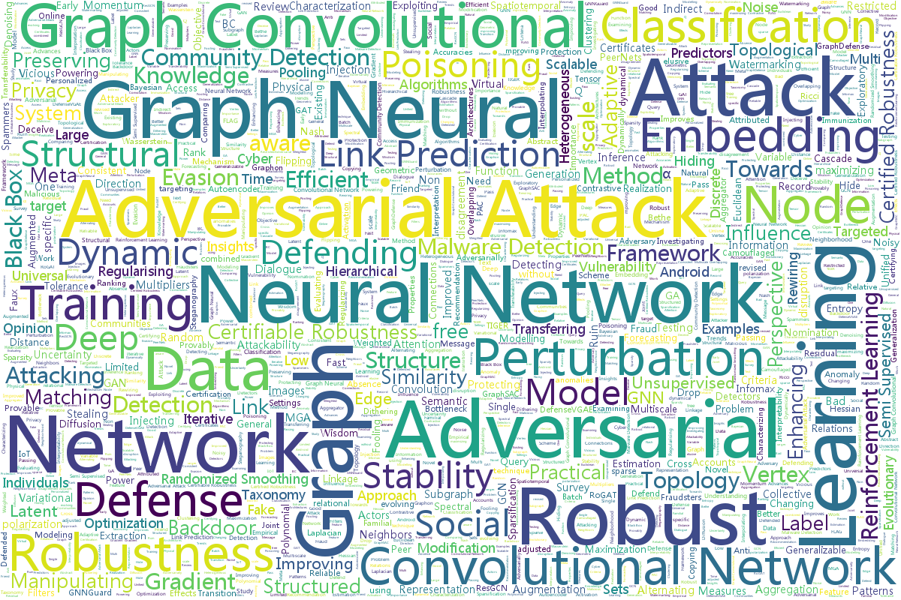

# ⚔🛡 Awesome Graph Adversarial Learning (Updating 323 papers)
[](https://github.com/sindresorhus/awesome)[](http://makeapullrequest.com)

<a class="toc" id="table-of-contents"></a>
- [⚔🛡 Awesome Graph Adversarial Learning (Updating 323 papers)](#-awesome-graph-adversarial-learning-updating-323-papers)
- [👀Quick Look](#quick-look)
- [⚔Attack](#attack)
  - [2022](#2022)
  - [2021](#2021)
  - [2020](#2020)
  - [2019](#2019)
  - [2018](#2018)
  - [2017](#2017)
- [🛡Defense](#defense)
  - [2022](#2022-1)
  - [2021](#2021-1)
  - [2020](#2020-1)
  - [2019](#2019-1)
  - [2018](#2018-1)
  - [2017](#2017-1)
- [🔐Certification](#certification)
- [⚖Stability](#stability)
- [🚀Others](#others)
- [📃Survey](#survey)
- [⚙Toolbox](#toolbox)
- [🔗Resource](#resource)



This repository contains Attack-related papers, Defense-related papers, Robustness Certification papers, etc., ranging from 2017 to 2021. 
If you find this repo useful, please cite:
*A Survey of Adversarial Learning on Graph, Arxiv'20*, [Link](https://arxiv.org/abs/2003.05730)

```bibtex
@article{chen2020survey,
  title={A Survey of Adversarial Learning on Graph},
  author={Chen, Liang and Li, Jintang and Peng, Jiaying and Xie, 
        Tao and Cao, Zengxu and Xu, Kun and He, Xiangnan and Zheng, Zibin},
  journal={arXiv preprint arXiv:2003.05730},
  year={2020}
}
```

# 👀Quick Look

The papers in this repo are categorized or sorted:

| [By Alphabet](Categorized/alphabet.md) | [By Year](Categorized/year.md) | [By Venue](Categorized/venue.md) | [Papers with Code](Categorized/papers_with_code.md) |

If you want to get a quick look at the recently updated papers in the repository (in 30 days), you can refer to [📍this](Categorized/recent.md).


# ⚔Attack


## 2022
[💨 Back to Top](#table-of-contents)

+ **Adversarial Attack on Graph Neural Networks as An Influence Maximization Problem**, *[📝WSDM](https://arxiv.org/abs/2106.10785)*, *[:octocat:Code](https://github.com/TheaperDeng/GNN-Attack-InfMax)*
+ **Inference Attacks Against Graph Neural Networks**, *[📝USENIX Security](https://arxiv.org/abs/2110.02631)*, *[:octocat:Code](https://github.com/Zhangzhk0819/GNN-Embedding-Leaks)*
+ **Model Stealing Attacks Against Inductive Graph Neural Networks**, *[📝IEEE Symposium on Security and Privacy](https://arxiv.org/abs/2112.08331)*, *[:octocat:Code](https://github.com/xinleihe/GNNStealing)*
+ **Unsupervised Graph Poisoning Attack via Contrastive Loss Back-propagation**, *[📝WWW](https://arxiv.org/abs/2201.07986)*, *[:octocat:Code](https://github.com/RinneSz/CLGA)*
+ **Neighboring Backdoor Attacks on Graph Convolutional Network**, *[📝arXiv](https://arxiv.org/abs/2201.06202)*, *[:octocat:Code](https://github.com/EdisonLeeeee/GraphWar)*
+ **Understanding and Improving Graph Injection Attack by Promoting Unnoticeability**, *[📝ICLR](https://openreview.net/forum?id=wkMG8cdvh7-)*, *[:octocat:Code](https://openreview.net/attachment?id=wkMG8cdvh7-&name=supplementary_material)*
+ **Blindfolded Attackers Still Threatening: Strict Black-Box Adversarial Attacks on Graphs**, *[📝AAAI](https://arxiv.org/abs/2012.06757)*, *[:octocat:Code](https://github.com/galina0217/stack)*
+ **More is Better (Mostly): On the Backdoor Attacks in Federated Graph Neural Networks**, *[📝arXiv](https://arxiv.org/abs/2202.03195)*
+ **Black-box Node Injection Attack for Graph Neural Networks**, *[📝arXiv](https://arxiv.org/abs/2202.09389)*, *[:octocat:Code](https://github.com/jumxglhf/GA2C)*
+ **Interpretable and Effective Reinforcement Learning for Attacking against Graph-based Rumor Detection**, *[📝arXiv](https://arxiv.org/abs/2201.05819)*
+ **Projective Ranking-based GNN Evasion Attacks**, *[📝arXiv](https://arxiv.org/abs/2202.12993)*
+ **GAP: Differentially Private Graph Neural Networks with Aggregation Perturbation**, *[📝arXiv](https://arxiv.org/abs/2203.00949)*

## 2021
[💨 Back to Top](#table-of-contents)

+ **Stealing Links from Graph Neural Networks**, *[📝USENIX Security](https://www.usenix.org/system/files/sec21summer_he.pdf)*
+ **PATHATTACK: Attacking Shortest Paths in Complex Networks**, *[📝arXiv](https://arxiv.org/abs/2104.03761)*
+ **Structack: Structure-based Adversarial Attacks on Graph Neural Networks**, *[📝ACM Hypertext](https://arxiv.org/abs/2107.11327)*, *[:octocat:Code](https://github.com/sqrhussain/structack)*
+ **Optimal Edge Weight Perturbations to Attack Shortest Paths**, *[📝arXiv](https://arxiv.org/abs/2107.03347)*
+ **GReady for Emerging Threats to Recommender Systems? A Graph Convolution-based Generative Shilling Attack**, *[📝Information Sciences](https://arxiv.org/abs/2107.10457)*
+ **Graph Adversarial Attack via Rewiring**, *[📝KDD](https://dl.acm.org/doi/abs/10.1145/3447548.3467416)*, *[:octocat:Code](https://github.com/alge24/ReWatt)*
+ **Membership Inference Attack on Graph Neural Networks**, *[📝arXiv](https://arxiv.org/abs/2101.06570)*
+ **BinarizedAttack: Structural Poisoning Attacks to Graph-based Anomaly Detection**, *[📝arXiv](https://arxiv.org/abs/2106.09989)*
+ **Graph Backdoor**, *[📝USENIX Security](https://arxiv.org/abs/2006.11890)*
+ **TDGIA: Effective Injection Attacks on Graph Neural Networks**, *[📝KDD](https://dl.acm.org/doi/abs/10.1145/3447548.3467314)*, *[:octocat:Code](https://github.com/THUDM/tdgia)*
+ **Adversarial Attack Framework on Graph Embedding Models with Limited Knowledge**, *[📝arXiv](https://arxiv.org/abs/2105.12419)*
+ **Adversarial Attack on Large Scale Graph**, *[📝TKDE](https://arxiv.org/abs/2009.03488)*, *[:octocat:Code](https://github.com/EdisonLeeeee/SGAttack)*
+ **Black-box Gradient Attack on Graph Neural Networks: Deeper Insights in Graph-based Attack and Defense**, *[📝arXiv](https://arxiv.org/abs/2104.15061)*
+ **Joint Detection and Localization of Stealth False Data Injection Attacks in Smart Grids using Graph Neural Networks**, *[📝arXiv](https://arxiv.org/abs/2104.11846)*
+ **Universal Spectral Adversarial Attacks for Deformable Shapes**, *[📝CVPR](https://arxiv.org/abs/2104.03356)*
+ **SAGE: Intrusion Alert-driven Attack Graph Extractor**, *[📝KDD Workshop](https://arxiv.org/abs/2107.02783)*, *[:octocat:Code](https://github.com/tudelft-cda-lab/SAGE)*
+ **Adversarial Diffusion Attacks on Graph-based Traffic Prediction Models**, *[📝arXiv](https://arxiv.org/abs/2104.09369)*, *[:octocat:Code](https://github.com/LYZ98/Adversarial-Diffusion-Attacks-on-Graph-based-Traffic-Prediction-Models)*
+ **VIKING: Adversarial Attack on Network Embeddings via Supervised Network Poisoning**, *[📝PAKDD](https://arxiv.org/abs/2102.07164)*, *[:octocat:Code](https://github.com/virresh/viking)*
+ **Explainability-based Backdoor Attacks Against Graph Neural Networks**, *[📝WiseML@WiSec](https://arxiv.org/abs/2104.03674)*
+ **GraphAttacker: A General Multi-Task GraphAttack Framework**, *[📝arXiv](https://arxiv.org/abs/2101.06855)*, *[:octocat:Code](https://github.com/honoluluuuu/GraphAttacker)*
+ **Attacking Graph Neural Networks at Scale**, *[📝AAAI workshop](https://www.dropbox.com/s/ddrwoswpz3wwx40/Robust_GNNs_at_Scale__AAAI_Workshop_2020_CameraReady.pdf?dl=0)*
+ **Node-Level Membership Inference Attacks Against Graph Neural Networks**, *[📝arXiv](https://arxiv.org/abs/2102.05429)*
+ **Reinforcement Learning For Data Poisoning on Graph Neural Networks**, *[📝arXiv](https://arxiv.org/abs/2102.06800)*
+ **DeHiB: Deep Hidden Backdoor Attack on Semi-Supervised Learning via Adversarial Perturbation**, *[📝AAAI](https://ojs.aaai.org/index.php/AAAI/article/view/17266)*
+ **Graphfool: Targeted Label Adversarial Attack on Graph Embedding**, *[📝arXiv](https://arxiv.org/abs/2102.12284)*
+ **Towards Revealing Parallel Adversarial Attack on Politician Socialnet of Graph Structure**, *[📝Security and Communication Networks](https://www.hindawi.com/journals/scn/2021/6631247)*
+ **Network Embedding Attack: An Euclidean Distance Based Method**, *[📝MDATA](https://link.springer.com/chapter/10.1007%2F978-3-030-71590-8_8)*
+ **Preserve, Promote, or Attack? GNN Explanation via Topology Perturbation**, *[📝arXiv](https://arxiv.org/abs/2103.12256)*
+ **Jointly Attacking Graph Neural Network and its Explanations**, *[📝arXiv](https://arxiv.org/abs/2108.03388)*
+ **Graph Stochastic Neural Networks for Semi-supervised Learning**, *[📝arXiv](https://papers.nips.cc/paper/2020/file/e586a4f55fb43a540c2e9dab45e00f53-Paper.pdf)*, *[:octocat:Code](https://github.com/GSNN/GSNN)*
+ **Iterative Deep Graph Learning for Graph Neural Networks: Better and Robust Node Embeddings**, *[📝arXiv](https://arxiv.org/abs/2006.13009)*, *[:octocat:Code](https://github.com/hugochan/IDGL)*
+ **Single-Node Attack for Fooling Graph Neural Networks**, *[📝KDD Workshop](https://drive.google.com/file/d/12arm9w6UmvSIzGmaoocdH70czx7RVzGr/view)*, *[:octocat:Code](https://github.com/gnnattack/SINGLE)*
+ **The Robustness of Graph k-shell Structure under Adversarial Attacks**, *[📝arXiv](https://arxiv.org/abs/2107.13962)*
+ **Poisoning Knowledge Graph Embeddings via Relation Inference Patterns**, *[📝ACL](https://aclanthology.org/2021.acl-long.147)*, *[:octocat:Code](https://github.com/PeruBhardwaj/InferenceAttack)*
+ **A Hard Label Black-box Adversarial Attack Against Graph Neural Networks**, *[📝CCS](https://arxiv.org/abs/2108.09513)*
+ **GNNUnlock: Graph Neural Networks-based Oracle-less Unlocking Scheme for Provably Secure Logic Locking**, *[📝DATE Conference](https://arxiv.org/abs/2104.13012)*
+ **Single Node Injection Attack against Graph Neural Networks**, *[📝CIKM](https://arxiv.org/abs/2108.13049)*, *[:octocat:Code](https://github.com/TaoShuchang/G-NIA)*
+ **Spatially Focused Attack against Spatiotemporal Graph Neural Networks**, *[📝arXiv](https://arxiv.org/abs/2109.04608)*
+ **Derivative-free optimization adversarial attacks for graph convolutional networks**, *[📝PeerJ](https://peerj.com/articles/cs-693)*
+ **Projective Ranking: A Transferable Evasion Attack Method on Graph Neural Networks**, *[📝CIKM](https://shiruipan.github.io/publication/cikm-21-zhang/cikm-21-zhang.pdf)*
+ **Query-based Adversarial Attacks on Graph with Fake Nodes**, *[📝arXiv](https://arxiv.org/abs/2109.13069)*
+ **Time-aware Gradient Attack on Dynamic Network Link Prediction**, *[📝TKDE](https://ieeexplore.ieee.org/abstract/document/9531428)*
+ **Graph-Fraudster: Adversarial Attacks on Graph Neural Network Based Vertical Federated Learning**, *[📝arXiv](https://arxiv.org/abs/2110.06468)*
+ **Adapting Membership Inference Attacks to GNN for Graph Classification: Approaches and Implications**, *[📝ICDM](https://arxiv.org/abs/2110.08760)*, *[:octocat:Code](https://github.com/TrustworthyGNN/MIA-GNN)*
+ **Surrogate Representation Learning with Isometric Mapping for Gray-box Graph Adversarial Attacks**, *[📝arXiv](https://arxiv.org/abs/2110.10482)*
+ **Watermarking Graph Neural Networks based on Backdoor Attacks**, *[📝arXiv](https://arxiv.org/abs/2110.11024)*
+ **Robustness of Graph Neural Networks at Scale**, *[📝NeurIPS](https://arxiv.org/pdf/2110.14038.pdf)*, *[:octocat:Code](https://github.com/sigeisler/robustness_of_gnns_at_scale)*
+ **Generalization of Neural Combinatorial Solvers Through the Lens of Adversarial Robustness**, *[📝NeurIPS](https://arxiv.org/abs/2110.10942)*
+ **Graph Structural Attack by Spectral Distance**, *[📝arXiv](https://arxiv.org/abs/2111.00684)*
+ **Graph Universal Adversarial Attacks: A Few Bad Actors Ruin Graph Learning Models**, *[📝IJCAI](https://www.ijcai.org/proceedings/2021/458)*, *[:octocat:Code](https://github.com/chisam0217/Graph-Universal-Attack)*
+ **Adversarial Attacks on Graph Classification via Bayesian Optimisation**, *[📝NeurIPS](https://arxiv.org/abs/2111.02842)*, *[:octocat:Code](https://github.com/xingchenwan/grabnel)*
+ **Adversarial Attacks on Knowledge Graph Embeddings via Instance Attribution Methods**, *[📝EMNLP](https://arxiv.org/abs/2111.03120)*, *[:octocat:Code](https://github.com/PeruBhardwaj/AttributionAttack)*
+ **COREATTACK: Breaking Up the Core Structure of Graphs**, *[📝arXiv](https://arxiv.org/abs/2111.15276)*
+ **UNTANGLE: Unlocking Routing and Logic Obfuscation Using Graph Neural Networks-based Link Prediction**, *[📝ICCAD](https://arxiv.org/abs/2111.07062)*, *[:octocat:Code](https://github.com/lilasrahis/untangle)*
+ **GraphMI: Extracting Private Graph Data from Graph Neural Networks**, *[📝IJCAI](https://www.ijcai.org/proceedings/2021/516)*, *[:octocat:Code](https://github.com/zaixizhang/GraphMI)*
+ **Structural Attack against Graph Based Android Malware Detection**, *[📝CCS](https://dl.acm.org/doi/abs/10.1145/3460120.3485387)*
+ **Adversarial Attack against Cross-lingual Knowledge Graph Alignment**, *[📝EMNLP](https://aclanthology.org/2021.emnlp-main.432)*
+ **FHA: Fast Heuristic Attack Against Graph Convolutional Networks**, *[📝ICDS](https://link.springer.com/chapter/10.1007/978-3-030-88942-5_12)*
+ **Task and Model Agnostic Adversarial Attack on Graph Neural Networks**, *[📝arXiv](https://arxiv.org/abs/2112.13267)*
+ **How Members of Covert Networks Conceal the Identities of Their Leaders**, *[📝ACM TIST](https://dl.acm.org/doi/full/10.1145/3490462)*


## 2020
[💨 Back to Top](#table-of-contents)

+ **A Graph Matching Attack on Privacy-Preserving Record Linkage**, *[📝CIKM](https://dl.acm.org/doi/abs/10.1145/3340531.3411931)*
+ **Semantic-preserving Reinforcement Learning Attack Against Graph Neural Networks for Malware Detection**, *[📝arXiv](https://arxiv.org/abs/2009.05602)*
+ **Adaptive Adversarial Attack on Graph Embedding via GAN**, *[📝SocialSec](https://link.springer.com/chapter/10.1007/978-981-15-9031-3_7)*
+ **Scalable Adversarial Attack on Graph Neural Networks with Alternating Direction Method of Multipliers**, *[📝arXiv](https://arxiv.org/abs/2009.10233)*
+ **One Vertex Attack on Graph Neural Networks-based Spatiotemporal Forecasting**, *[📝ICLR OpenReview](https://openreview.net/forum?id=W0MKrbVOxtd)*
+ **Near-Black-Box Adversarial Attacks on Graph Neural Networks as An Influence Maximization Problem**, *[📝ICLR OpenReview](https://openreview.net/forum?id=sbyjwhxxT8K)*
+ **Adversarial Attacks on Deep Graph Matching**, *[📝NeurIPS](https://papers.nips.cc/paper/2020/file/ef126722e64e98d1c33933783e52eafc-Paper.pdf)*
+ **Attacking Graph-Based Classification without Changing Existing Connections**, *[📝ACSAC](https://cse.sc.edu/~zeng1/papers/2020-acsac-graph.pdf)*
+ **Cross Entropy Attack on Deep Graph Infomax**, *[📝IEEE ISCAS](https://ieeexplore.ieee.org/document/9180817)*
+ **Model Extraction Attacks on Graph Neural Networks: Taxonomy and Realization**, *[📝arXiv](https://arxiv.org/abs/2010.12751)*
+ **Learning to Deceive Knowledge Graph Augmented Models via Targeted Perturbation**, *[📝ICLR](https://arxiv.org/abs/2010.12872)*, *[:octocat:Code](https://github.com/INK-USC/deceive-KG-models)*
+ **Towards More Practical Adversarial Attacks on Graph Neural Networks**, *[📝NeurIPS](https://arxiv.org/abs/2006.05057)*, *[:octocat:Code](https://github.com/Mark12Ding/GNN-Practical-Attack)*
+ **Adversarial Label-Flipping Attack and Defense for Graph Neural Networks**, *[📝ICDM](http://shichuan.org/doc/97.pdf)*, *[:octocat:Code](https://github.com/MengmeiZ/LafAK)*
+ **Exploratory Adversarial Attacks on Graph Neural Networks**, *[📝ICDM](https://ieeexplore.ieee.org/document/9338329)*, *[:octocat:Code](https://github.com/EpoAtk/EpoAtk)*
+ **A Targeted Universal Attack on Graph Convolutional Network**, *[📝arXiv](https://arxiv.org/abs/2011.14365)*, *[:octocat:Code](https://github.com/Nanyuu/TUA)*
+ **Query-free Black-box Adversarial Attacks on Graphs**, *[📝arXiv](https://arxiv.org/abs/2012.06757)*
+ **Reinforcement Learning-based Black-Box Evasion Attacks to Link Prediction in Dynamic Graphs**, *[📝arXiv](https://arxiv.org/abs/2009.00163)*
+ **Efficient Evasion Attacks to Graph Neural Networks via Influence Function**, *[📝arXiv](https://arxiv.org/abs/2009.00203)*
+ **Backdoor Attacks to Graph Neural Networks**, *[📝SACMAT](https://dl.acm.org/doi/pdf/10.1145/3450569.3463560)*, *[:octocat:Code](https://github.com/zaixizhang/graphbackdoor)*
+ **Link Prediction Adversarial Attack Via Iterative Gradient Attack**, *[📝IEEE Trans](https://ieeexplore.ieee.org/abstract/document/9141291)*
+ **Adversarial Attack on Hierarchical Graph Pooling Neural Networks**, *[📝arXiv](https://arxiv.org/abs/2005.11560)*
+ **Adversarial Attack on Community Detection by Hiding Individuals**, *[📝WWW](https://arxiv.org/abs/2001.07933)*, *[:octocat:Code](https://github.com/halimiqi/CD-ATTACK)*
+ **Manipulating Node Similarity Measures in Networks**, *[📝AAMAS](https://arxiv.org/abs/1910.11529)*
+ **A Restricted Black-box Adversarial Framework Towards Attacking Graph Embedding Models**, *[📝AAAI](https://arxiv.org/abs/1908.01297)*, *[:octocat:Code](https://github.com/SwiftieH/GFAttack)*
+ **Indirect Adversarial Attacks via Poisoning Neighbors for Graph Convolutional Networks**, *[📝BigData](https://arxiv.org/abs/2002.08012)*
+ **Adversarial Attacks on Graph Neural Networks via Node Injections: A Hierarchical Reinforcement Learning Approach**, *[📝WWW](https://dl.acm.org/doi/10.1145/3366423.3380149)*
+ **An Efficient Adversarial Attack on Graph Structured Data**, *[📝IJCAI Workshop](https://www.aisafetyw.org/programme)*
+ **Practical Adversarial Attacks on Graph Neural Networks**, *[📝ICML Workshop](https://grlplus.github.io/papers/8.pdf)*
+ **Adversarial Attacks on Graph Neural Networks: Perturbations and their Patterns**, *[📝TKDD](https://dl.acm.org/doi/10.1145/3394520)*
+ **Adversarial Attacks on Link Prediction Algorithms Based on Graph Neural Networks**, *[📝Asia CCS](https://iqua.ece.toronto.edu/papers/wlin-asiaccs20.pdf)*
+ **Scalable Attack on Graph Data by Injecting Vicious Nodes**, *[📝ECML-PKDD](https://arxiv.org/abs/2004.13825)*, *[:octocat:Code](https://github.com/wangjh-github/AFGSM)*
+ **Attackability Characterization of Adversarial Evasion Attack on Discrete Data**, *[📝KDD](https://dl.acm.org/doi/10.1145/3394486.3403194)*
+ **MGA: Momentum Gradient Attack on Network**, *[📝arXiv](https://arxiv.org/abs/2002.11320)*
+ **Adversarial Attacks to Scale-Free Networks: Testing the Robustness of Physical Criteria**, *[📝arXiv](https://arxiv.org/abs/2002.01249)*
+ **Adversarial Perturbations of Opinion Dynamics in Networks**, *[📝arXiv](https://arxiv.org/abs/2003.07010)*
+ **Network disruption: maximizing disagreement and polarization in social networks**, *[📝arXiv](https://arxiv.org/abs/2003.08377)*, *[:octocat:Code](https://github.com/mayee107/network-disruption)*
+ **Adversarial attack on BC classification for scale-free networks**, *[📝AIP Chaos](https://aip.scitation.org/doi/10.1063/5.0003707)*

## 2019
[💨 Back to Top](#table-of-contents)

+ **Attacking Graph Convolutional Networks via Rewiring**, *[📝arXiv](https://arxiv.org/abs/1906.03750)*
+ **Unsupervised Euclidean Distance Attack on Network Embedding**, *[📝arXiv](https://arxiv.org/abs/1905.11015)*
+ **Structured Adversarial Attack Towards General Implementation and Better Interpretability**, *[📝ICLR](https://arxiv.org/abs/1808.01664)*, *[:octocat:Code](https://github.com/KaidiXu/StrAttack)*
+ **Generalizable Adversarial Attacks with Latent Variable Perturbation Modelling**, *[📝arXiv](https://arxiv.org/abs/1905.10864)*
+ **Vertex Nomination, Consistent Estimation, and Adversarial Modification**, *[📝arXiv](https://arxiv.org/abs/1905.01776)*
+ **PeerNets Exploiting Peer Wisdom Against Adversarial Attacks**, *[📝ICLR](https://arxiv.org/abs/1806.00088)*, *[:octocat:Code](https://github.com/tantara/PeerNets-pytorch)*
+ **Network Structural Vulnerability A Multi-Objective Attacker Perspective**, *[📝IEEE Trans](https://ieeexplore.ieee.org/document/8275029)*
+ **Multiscale Evolutionary Perturbation Attack on Community Detection**, *[📝arXiv](https://arxiv.org/abs/1910.09741)*
+ **αCyber: Enhancing Robustness of Android Malware Detection System against Adversarial Attacks on Heterogeneous Graph based Model**, *[📝CIKM](https://dl.acm.org/doi/10.1145/3357384.3357875)*
+ **Adversarial Attacks on Node Embeddings via Graph Poisoning**, *[📝ICML](https://arxiv.org/abs/1809.01093)*, *[:octocat:Code](https://github.com/abojchevski/node_embedding_attack)*
+ **GA Based Q-Attack on Community Detection**, *[📝TCSS](https://arxiv.org/abs/1811.00430)*
+ **Data Poisoning Attack against Knowledge Graph Embedding**, *[📝IJCAI](https://arxiv.org/abs/1904.12052)*
+ **Adversarial Attacks on Graph Neural Networks via Meta Learning**, *[📝ICLR](https://arxiv.org/abs/1902.08412)*, *[:octocat:Code](https://github.com/danielzuegner/gnn-meta-attack)*
+ **Topology Attack and Defense for Graph Neural Networks: An Optimization Perspective**, *[📝IJCAI](https://arxiv.org/abs/1906.04214)*, *[:octocat:Code](https://github.com/KaidiXu/GCN_ADV_Train)*
+ **Adversarial Examples on Graph Data: Deep Insights into Attack and Defense**, *[📝IJCAI](https://arxiv.org/abs/1903.01610)*, *[:octocat:Code](https://github.com/stellargraph/stellargraph/tree/develop/demos/interpretability)*
+ **A Unified Framework for Data Poisoning Attack to Graph-based Semi-supervised Learning**, *[📝NeurIPS](https://arxiv.org/abs/1910.14147)*, *[:octocat:Code](https://github.com/xuanqing94/AdvSSL)*
+ **Attacking Graph-based Classification via Manipulating the Graph Structure**, *[📝CCS](https://arxiv.org/abs/1903.00553)*

## 2018
[💨 Back to Top](#table-of-contents)

+ **Fake Node Attacks on Graph Convolutional Networks**, *[📝arXiv](https://arxiv.org/abs/1810.10751)*
+ **Data Poisoning Attack against Unsupervised Node Embedding Methods**, *[📝arXiv](https://arxiv.org/abs/1810.12881)*
+ **Fast Gradient Attack on Network Embedding**, *[📝arXiv](https://arxiv.org/abs/1809.02797)*
+ **Attack Tolerance of Link Prediction Algorithms: How to Hide Your Relations in a Social Network**, *[📝arXiv](https://arxiv.org/abs/1809.00152)*
+ **Adversarial Attacks on Neural Networks for Graph Data**, *[📝KDD](https://arxiv.org/abs/1805.07984)*, *[:octocat:Code](https://github.com/danielzuegner/nettack)*
+ **Hiding Individuals and Communities in a Social Network**, *[📝Nature Human Behavior](https://arxiv.org/abs/1608.00375)*
+ **Attacking Similarity-Based Link Prediction in Social Networks**, *[📝AAMAS](https://arxiv.org/abs/1809.08368)*
+ **Adversarial Attack on Graph Structured Data**, *[📝ICML](https://arxiv.org/abs/1806.02371)*, *[:octocat:Code](https://github.com/Hanjun-Dai/graph_adversarial_attack)*

## 2017
[💨 Back to Top](#table-of-contents)

+ **Practical Attacks Against Graph-based Clustering**, *[📝CCS](https://arxiv.org/abs/1708.09056)*
+ **Adversarial Sets for Regularising Neural Link Predictors**, *[📝UAI](https://arxiv.org/abs/1707.07596)*, *[:octocat:Code](https://github.com/uclmr/inferbeddings)*


# 🛡Defense

## 2022
[💨 Back to Top](#table-of-contents)
+ **Unsupervised Adversarially-Robust Representation Learning on Graphs**, *[📝AAAI](https://arxiv.org/abs/2012.02486)*, *[:octocat:Code](https://github.com/galina0217/robustgraph)*
+ **Towards Robust Graph Neural Networks for Noisy Graphs with Sparse Labels**, *[📝arXiv](https://arxiv.org/abs/2201.00232)*, *[:octocat:Code](https://github.com/EnyanDai/RSGNN)*
+ **Mind Your Solver! On Adversarial Attack and Defense for Combinatorial Optimization**, *[📝arXiv](https://arxiv.org/abs/2201.004022)*, *[:octocat:Code](https://github.com/EnyanDai/RSGNN)*
+ **Learning Robust Representation through Graph Adversarial Contrastive Learning**, *[📝arXiv](https://arxiv.org/abs/2201.13025)*
+ **GARNET: Reduced-Rank Topology Learning for Robust and Scalable Graph Neural Networks**, *[📝arXiv](https://arxiv.org/abs/2201.12741)*
+ **Graph Neural Network for Local Corruption Recovery**, *[📝arXiv](https://arxiv.org/abs/2202.04936)*, *[:octocat:Code](https://github.com/bzho3923/MAGnet)*
+ **Robust Heterogeneous Graph Neural Networks against Adversarial Attacks**, *[📝AAAI](http://shichuan.org/doc/132.pdf)*, *[:octocat:Code](https://github.com/bzho3923/MAGnet)*
+ **How Does Bayesian Noisy Self-Supervision Defend Graph Convolutional Networks?**, *[📝Neural Processing Letters](https://link.springer.com/article/10.1007/s11063-022-10750-8)*
+ **Defending Graph Convolutional Networks against Dynamic Graph Perturbations via Bayesian Self-supervision**, *[📝AAAI](https://arxiv.org/abs/2203.03762)*, *[:octocat:Code](https://github.com/junzhuang-code/GraphSS)*
+ **SimGRACE: A Simple Framework for Graph Contrastive Learning without Data Augmentation**, *[📝WWW](https://arxiv.org/abs/2202.03104)*, *[:octocat:Code](https://github.com/junxia97/SimGRACE)*
+ **Exploring High-Order Structure for Robust Graph Structure Learning**, *[📝arXiv](https://arxiv.org/abs/2203.11492)*


## 2021
[💨 Back to Top](#table-of-contents)

+ **Learning to Drop: Robust Graph Neural Network via Topological Denoising**, *[📝WSDM](https://arxiv.org/abs/2011.07057)*, *[:octocat:Code](https://github.com/flyingdoog/PTDNet)*
+ **How effective are Graph Neural Networks in Fraud Detection for Network Data?**, *[📝arXiv](https://arxiv.org/abs/2105.14568)*
+ **Graph Sanitation with Application to Node Classification**, *[📝arXiv](https://arxiv.org/abs/2105.09384)*
+ **Understanding Structural Vulnerability in Graph Convolutional Networks**, *[📝IJCAI](https://www.ijcai.org/proceedings/2021/310)*, *[:octocat:Code](https://github.com/EdisonLeeeee/MedianGCN)*
+ **A Robust and Generalized Framework for Adversarial Graph Embedding**, *[📝arXiv](https://arxiv.org/abs/2105.10651)*, *[:octocat:Code](https://github.com/RingBDStack/AGE)*
+ **Integrated Defense for Resilient Graph Matching**, *[📝ICML](http://proceedings.mlr.press/v139/ren21c/ren21c.pdf)*
+ **Unveiling Anomalous Nodes Via Random Sampling and Consensus on Graphs**, *[📝ICASSP](https://ieeexplore.ieee.org/abstract/document/9414953)*
+ **Robust Network Alignment via Attack Signal Scaling and Adversarial Perturbation Elimination**, *[📝WWW](http://eng.auburn.edu/users/yangzhou/papers/RNA.pdf)*
+ **Information Obfuscation of Graph Neural Network**, *[📝ICML](https://arxiv.org/pdf/2009.13504.pdf)*, *[:octocat:Code](https://github.com/liaopeiyuan/GAL)*
+ **Improving Robustness of Graph Neural Networks with Heterophily-Inspired Designs**, *[📝arXiv](https://arxiv.org/abs/2106.07767)*
+ **On Generalization of Graph Autoencoders with Adversarial Training**, *[📝ECML](https://arxiv.org/abs/2107.02658)*
+ **DeepInsight: Interpretability Assisting Detection of Adversarial Samples on Graphs**, *[📝ECML](https://arxiv.org/abs/2106.09501)*
+ **Elastic Graph Neural Networks**, *[📝ICML](http://proceedings.mlr.press/v139/liu21k/liu21k.pdf)*, *[:octocat:Code](https://github.com/lxiaorui/ElasticGNN)*
+ **Robust Counterfactual Explanations on Graph Neural Networks**, *[📝arXiv](https://arxiv.org/abs/2107.04086)*
+ **Node Similarity Preserving Graph Convolutional Networks**, *[📝WSDM](https://arxiv.org/abs/2011.09643)*, *[:octocat:Code](https://github.com/ChandlerBang/SimP-GCN)*
+ **Enhancing Robustness and Resilience of Multiplex Networks Against Node-Community Cascading Failures**, *[📝IEEE TSMC](https://ieeexplore.ieee.org/abstract/document/9415463)*
+ **NetFense: Adversarial Defenses against Privacy Attacks on Neural Networks for Graph Data**, *[📝TKDE](https://arxiv.org/abs/2106.11865)*, *[:octocat:Code](https://github.com/ICHproject/NetFense)*
+ **Robust Graph Learning Under Wasserstein Uncertainty**, *[📝arXiv](https://arxiv.org/abs/2105.04210)*
+ **Towards Robust Graph Contrastive Learning**, *[📝arXiv](https://arxiv.org/abs/2102.13085)*
+ **Expressive 1-Lipschitz Neural Networks for Robust Multiple Graph Learning against Adversarial Attacks**, *[📝ICML](http://proceedings.mlr.press/v139/zhao21e.html)*
+ **UAG: Uncertainty-Aware Attention Graph Neural Network for Defending Adversarial Attacks**, *[📝AAAI](https://arxiv.org/abs/2009.10235)*
+ **Uncertainty-Matching Graph Neural Networks to Defend Against Poisoning Attacks**, *[📝AAAI](https://arxiv.org/abs/2009.14455)*
+ **Power up! Robust Graph Convolutional Network against Evasion Attacks based on Graph Powering**, *[📝AAAI](https://arxiv.org/abs/1905.10029)*, *[:octocat:Code](https://www.dropbox.com/sh/p36pzx1ock2iamo/AABEr7FtM5nqwC4i9nICLIsta?dl=0)*
+ **Personalized privacy protection in social networks through adversarial modeling**, *[📝AAAI](https://www.cs.uic.edu/~elena/pubs/biradar-ppai21.pdf)*
+ **Interpretable Stability Bounds for Spectral Graph Filters**, *[📝arXiv](https://arxiv.org/abs/2102.09587)*
+ **Randomized Generation of Adversary-Aware Fake Knowledge Graphs to Combat Intellectual Property Theft**, *[📝AAAI](http://34.94.61.102/paper_AAAI-9475.html)*
+ **Unified Robust Training for Graph NeuralNetworks against Label Noise**, *[📝arXiv](https://arxiv.org/abs/2103.03414)*
+ **An Introduction to Robust Graph Convolutional Networks**, *[📝arXiv](https://arxiv.org/abs/2103.14807)*
+ **E-GraphSAGE: A Graph Neural Network based Intrusion Detection System**, *[📝arXiv](https://arxiv.org/abs/2103.16329)*
+ **Spatio-Temporal Sparsification for General Robust Graph Convolution Networks**, *[📝arXiv](https://arxiv.org/abs/2103.12256)*
+ **Robust graph convolutional networks with directional graph adversarial training**, *[📝Applied Intelligence](https://link.springer.com/article/10.1007/s10489-021-02272-y)*
+ **Detection and Defense of Topological Adversarial Attacks on Graphs**, *[📝AISTATS](http://proceedings.mlr.press/v130/zhang21i.html)*
+ **Unveiling the potential of Graph Neural Networks for robust Intrusion Detection**, *[📝arXiv](https://arxiv.org/abs/2107.14747)*, *[:octocat:Code](https://github.com/BNN-UPC/GNN-NIDS)*
+ **Adversarial Robustness of Probabilistic Network Embedding for Link Prediction**, *[📝arXiv](https://arxiv.org/abs/2107.01936)*
+ **EGC2: Enhanced Graph Classification with Easy Graph Compression**, *[📝arXiv](https://arxiv.org/abs/2107.07737)*
+ **LinkTeller: Recovering Private Edges from Graph Neural Networks via Influence Analysis**, *[📝arXiv](https://arxiv.org/abs/2108.06504)*
+ **Structure-Aware Hierarchical Graph Pooling using Information Bottleneck**, *[📝IJCNN ](https://arxiv.org/abs/2104.13012)*
+ **Mal2GCN: A Robust Malware Detection Approach Using Deep Graph Convolutional Networks With Non-Negative Weights**, *[📝arXiv](https://arxiv.org/abs/2108.12473)*
+ **CoG: a Two-View Co-training Framework for Defending Adversarial Attacks on Graph**, *[📝arXiv](https://arxiv.org/abs/2109.05558)*
+ **Releasing Graph Neural Networks with Differential Privacy Guarantees**, *[📝arXiv](https://arxiv.org/abs/2109.08907)*
+ **Speedup Robust Graph Structure Learning with Low-Rank Information**, *[📝CIKM](http://xiangliyao.cn/papers/cikm21-hui.pdf)*
+ **A Lightweight Metric Defence Strategy for Graph Neural Networks Against Poisoning Attacks**, *[📝ICICS](https://link.springer.com/chapter/10.1007/978-3-030-88052-1_4)*, *[:octocat:Code](https://github.com/lizi-learner/MD-GNN)*
+ **Node Feature Kernels Increase Graph Convolutional Network Robustness**, *[📝arXiv](https://arxiv.org/abs/2109.01785)*, *[:octocat:Code](https://github.com/ChangminWu/RobustGCN)*
+ **On the Relationship between Heterophily and Robustness of Graph Neural Networks**, *[📝arXiv](https://arxiv.org/abs/2106.07767)*
+ **Distributionally Robust Semi-Supervised Learning Over Graphs**, *[📝ICLR](https://arxiv.org/abs/2110.10582)*
+ **Robustness of Graph Neural Networks at Scale**, *[📝NeurIPS](https://arxiv.org/pdf/2110.14038.pdf)*, *[:octocat:Code](https://github.com/sigeisler/robustness_of_gnns_at_scale)*
+ **Graph Transplant: Node Saliency-Guided Graph Mixup with Local Structure Preservation**, *[📝arXiv](https://arxiv.org/abs/2111.05639)*
+ **Not All Low-Pass Filters are Robust in Graph Convolutional Networks**, *[📝NeurIPS](https://openreview.net/forum?id=bDdfxLQITtu)*, *[:octocat:Code](https://github.com/SwiftieH/LFR)*
+ **Towards Robust Reasoning over Knowledge Graphs**, *[📝arXiv](https://arxiv.org/abs/2110.14693)*
+ **Robust Graph Neural Networks via Probabilistic Lipschitz Constraints**, *[📝arXiv](https://arxiv.org/abs/2112.07575)*
+ **Graph Neural Networks with Adaptive Residual**, *[NeurIPS](https://openreview.net/forum?id=hfkER_KJiNw)*, *[:octocat:Code](https://github.com/lxiaorui/AirGNN)*
+ **Graph-based Adversarial Online Kernel Learning with Adaptive Embedding**, *[📝ICDM]()*
+ **Graph Posterior Network: Bayesian Predictive Uncertainty for Node Classification**, *[📝NeurIPS](https://arxiv.org/pdf/2110.14012.pdf)*, *[:octocat:Code](https://github.com/stadlmax/Graph-Posterior-Network)*
+ **Graph Neural Networks with Feature and Structure Aware Random Walk**, *[📝arXiv](https://arxiv.org/abs/2111.10102)*

## 2020
[💨 Back to Top](#table-of-contents)

+ **Ricci-GNN: Defending Against Structural Attacks Through a Geometric Approach**, *[📝ICLR OpenReview](https://openreview.net/forum?id=_qoQkWNEhS)*
+ **Provable Overlapping Community Detection in Weighted Graphs**, *[📝NeurIPS](https://arxiv.org/abs/2004.07150)*
+ **Variational Inference for Graph Convolutional Networks in the Absence of Graph Data and Adversarial Settings**, *[📝NeurIPS](https://arxiv.org/abs/1906.01852)*, *[:octocat:Code](https://github.com/ebonilla/VGCN)*
+ **Graph Random Neural Networks for Semi-Supervised Learning on Graphs**, *[📝NeurIPS](https://arxiv.org/abs/2005.11079)*, *[:octocat:Code](https://github.com/Grand20/grand)*
+ **Reliable Graph Neural Networks via Robust Aggregation**, *[📝NeurIPS](https://arxiv.org/abs/2010.15651)*, *[:octocat:Code](https://github.com/sigeisler/reliable_gnn_via_robust_aggregation)*
+ **Towards Robust Graph Neural Networks against Label Noise**, *[📝ICLR OpenReview](https://openreview.net/forum?id=H38f_9b90BO)*
+ **Graph Adversarial Networks: Protecting Information against Adversarial Attacks**, *[📝ICLR OpenReview](https://openreview.net/forum?id=Q8ZdJahesWe)*, *[:octocat:Code](https://github.com/liaopeiyuan/GAL)*
+ **A Novel Defending Scheme for Graph-Based Classification Against Graph Structure Manipulating Attack**, *[📝SocialSec](https://link.springer.com/chapter/10.1007/978-981-15-9031-3_26)*
+ **Iterative Deep Graph Learning for Graph Neural Networks: Better and Robust Node Embeddings**, *[📝NeurIPS](https://arxiv.org/abs/2006.13009)*, *[:octocat:Code](https://github.com/hugochan/IDGL)*
+ **Node Copying for Protection Against Graph Neural Network Topology Attacks**, *[📝arXiv](https://arxiv.org/abs/2007.06704)*
+ **Community detection in sparse time-evolving graphs with a dynamical Bethe-Hessian**, *[📝NeurIPS](https://arxiv.org/abs/2006.04510)*
+ **A Feature-Importance-Aware and Robust Aggregator for GCN**, *[📝CIKM](https://dl.acm.org/doi/abs/10.1145/3340531.3411983)*, *[:octocat:Code](https://github.com/LiZhang-github/LA-GCN)*
+ **Anti-perturbation of Online Social Networks by Graph Label Transition**, *[📝arXiv](https://arxiv.org/abs/2010.14121)*
+ **Graph Information Bottleneck**, *[📝NeurIPS](https://arxiv.org/abs/2010.12811)*, *[:octocat:Code](http://snap.stanford.edu/gib/)*
+ **Adversarial Detection on Graph Structured Data**, *[📝PPMLP](https://dl.acm.org/doi/abs/10.1145/3411501.3419424)*
+ **Graph Contrastive Learning with Augmentations**, *[📝NeurIPS](https://arxiv.org/abs/2010.13902)*, *[:octocat:Code](https://github.com/Shen-Lab/GraphCL)*
+ **Learning Graph Embedding with Adversarial Training Methods**, *[📝IEEE Transactions on Cybernetics](https://arxiv.org/abs/1901.01250)*
+ **I-GCN: Robust Graph Convolutional Network via Influence Mechanism**, *[📝arXiv](https://arxiv.org/abs/2012.06110)*
+ **Adversary for Social Good: Protecting Familial Privacy through Joint Adversarial Attacks**, *[📝AAAI](https://ojs.aaai.org//index.php/AAAI/article/view/6791)*
+ **Smoothing Adversarial Training for GNN**, *[📝IEEE TCSS](https://ieeexplore.ieee.org/abstract/document/9305289?casa_token=fTXIL3hT1yIAAAAA:I4fn-GlF0PIwzPRC87SayRi5_pi2ZDDuSancEsY96A4O4bUBEsp0hSYMNJVGVzMgBWxycYN9qu6D)*
+ **Graph Structure Reshaping Against Adversarial Attacks on Graph Neural Networks**, *[📝None](None)*, *[:octocat:Code](https://github.com/GraphReshape/GraphReshape)*
+ **RoGAT: a robust GNN combined revised GAT with adjusted graphs**, *[📝arXiv](https://arxiv.org/abs/2009.13038)*
+ **ResGCN: Attention-based Deep Residual Modeling for Anomaly Detection on Attributed Networks**, *[📝arXiv](https://arxiv.org/abs/2009.14738)*
+ **Adversarial Perturbations of Opinion Dynamics in Networks**, *[📝arXiv](https://arxiv.org/abs/2003.07010)*
+ **Adversarial Privacy Preserving Graph Embedding against Inference Attack**, *[📝arXiv](https://arxiv.org/abs/2008.13072)*, *[:octocat:Code](https://github.com/uJ62JHD/Privacy-Preserving-Social-Network-Embedding)*
+ **Robust Graph Learning From Noisy Data**, *[📝IEEE Trans](https://ieeexplore.ieee.org/abstract/document/8605364)*
+ **GNNGuard: Defending Graph Neural Networks against Adversarial Attacks**, *[📝NeurIPS](https://arxiv.org/abs/2006.08149)*, *[:octocat:Code](https://github.com/mims-harvard/GNNGuard)*
+ **Transferring Robustness for Graph Neural Network Against Poisoning Attacks**, *[📝WSDM](https://arxiv.org/abs/1908.07558)*, *[:octocat:Code](https://github.com/tangxianfeng/PA-GNN)*
+ **All You Need Is Low (Rank): Defending Against Adversarial Attacks on Graphs**, *[📝WSDM](https://dl.acm.org/doi/abs/10.1145/3336191.3371789)*, *[:octocat:Code](https://github.com/DSE-MSU/DeepRobust)*
+ **How Robust Are Graph Neural Networks to Structural Noise?**, *[📝DLGMA](https://arxiv.org/abs/1912.10206)*
+ **Robust Detection of Adaptive Spammers by Nash Reinforcement Learning**, *[📝KDD](https://arxiv.org/abs/2006.06069)*, *[:octocat:Code](https://github.com/YingtongDou/Nash-Detect)*
+ **Graph Structure Learning for Robust Graph Neural Networks**, *[📝KDD](https://arxiv.org/abs/2005.10203)*, *[:octocat:Code](https://github.com/DSE-MSU/DeepRobust)*
+ **On The Stability of Polynomial Spectral Graph Filters**, *[📝ICASSP](https://ieeexplore.ieee.org/abstract/document/9054072)*, *[:octocat:Code](https://github.com/henrykenlay/spgf)*
+ **On the Robustness of Cascade Diffusion under Node Attacks**, *[📝WWW](https://www.cs.au.dk/~karras/robustIC.pdf)*, *[:octocat:Code](https://github.com/allogn/robustness)*
+ **Friend or Faux: Graph-Based Early Detection of Fake Accounts on Social Networks**, *[📝WWW](https://arxiv.org/abs/2004.04834)*
+ **Towards an Efficient and General Framework of Robust Training for Graph Neural Networks**, *[📝ICASSP](https://arxiv.org/abs/2002.10947)*
+ **Robust Graph Representation Learning via Neural Sparsification**, *[📝ICML](https://proceedings.icml.cc/static/paper_files/icml/2020/2611-Paper.pdf)*
+ **Robust Training of Graph Convolutional Networks via Latent Perturbation**, *[📝ECML-PKDD](https://www.cs.uic.edu/~zhangx/papers/JinZha20.pdf)*
+ **Robust Collective Classification against Structural Attacks**, *[📝Preprint](http://www.auai.org/uai2020/proceedings/119_main_paper.pdf)*
+ **Enhancing Graph Neural Network-based Fraud Detectors against Camouflaged Fraudsters**, *[📝CIKM](https://arxiv.org/abs/2008.08692)*, *[:octocat:Code](https://github.com/safe-graph/DGFraud)*
+ **Topological Effects on Attacks Against Vertex Classification**, *[📝arXiv](https://arxiv.org/abs/2003.05822)*
+ **Tensor Graph Convolutional Networks for Multi-relational and Robust Learning**, *[📝arXiv](https://arxiv.org/abs/2003.07729)*
+ **DefenseVGAE: Defending against Adversarial Attacks on Graph Data via a Variational Graph Autoencoder**, *[📝arXiv](https://arxiv.org/abs/2006.08900)*, *[:octocat:Code](https://github.com/zhangao520/defense-vgae)*
+ **Dynamic Knowledge Graph-based Dialogue Generation with Improved Adversarial Meta-Learning**, *[📝arXiv](https://arxiv.org/abs/2004.08833)*
+ **AANE: Anomaly Aware Network Embedding For Anomalous Link Detection**, *[📝ICDM](https://ieeexplore.ieee.org/document/9338406)*
+ **Provably Robust Node Classification via Low-Pass Message Passing**, *[📝ICDM](https://shenghua-liu.github.io/papers/icdm2020-provablerobust.pdf)*
+ **Graph-Revised Convolutional Network**, *[📝ECML-PKDD](https://arxiv.org/abs/1911.07123)*, *[:octocat:Code](https://github.com/PlusRoss/GRCN)*

## 2019
[💨 Back to Top](#table-of-contents)

+ **Graph Adversarial Training: Dynamically Regularizing Based on Graph Structure**, *[📝TKDE](https://arxiv.org/abs/1902.08226)*, *[:octocat:Code](https://github.com/fulifeng/GraphAT)*
+ **Bayesian graph convolutional neural networks for semi-supervised classification**, *[📝AAAI](https://arxiv.org/abs/1811.11103)*, *[:octocat:Code](https://github.com/huawei-noah/BGCN)*
+ **Target Defense Against Link-Prediction-Based Attacks via Evolutionary Perturbations**, *[📝arXiv](https://arxiv.org/abs/1809.05912)*
+ **Examining Adversarial Learning against Graph-based IoT Malware Detection Systems**, *[📝arXiv](https://arxiv.org/abs/1902.04416)*
+ **Adversarial Embedding: A robust and elusive Steganography and Watermarking technique**, *[📝arXiv](https://arxiv.org/abs/1912.01487)*
+ **Graph Interpolating Activation Improves Both Natural and Robust Accuracies in Data-Efficient Deep Learning**, *[📝arXiv](https://arxiv.org/abs/1907.06800)*, *[:octocat:Code](https://github.com/BaoWangMath/DNN-DataDependentActivation)*
+ **Adversarial Defense Framework for Graph Neural Network**, *[📝arXiv](https://arxiv.org/abs/1905.03679)*
+ **GraphSAC: Detecting anomalies in large-scale graphs**, *[📝arXiv](https://arxiv.org/abs/1910.09589)*
+ **Edge Dithering for Robust Adaptive Graph Convolutional Networks**, *[📝arXiv](https://arxiv.org/abs/1910.09590)*
+ **Can Adversarial Network Attack be Defended?**, *[📝arXiv](https://arxiv.org/abs/1903.05994)*
+ **GraphDefense: Towards Robust Graph Convolutional Networks**, *[📝arXiv](https://arxiv.org/abs/1911.04429)*
+ **Adversarial Training Methods for Network Embedding**, *[📝WWW](https://arxiv.org/abs/1908.11514)*, *[:octocat:Code](https://github.com/wonniu/AdvT4NE_WWW2019)*
+ **Adversarial Examples on Graph Data: Deep Insights into Attack and Defense**, *[📝IJCAI](https://arxiv.org/abs/1903.01610)*, *[:octocat:Code](https://github.com/DSE-MSU/DeepRobust)*
+ **Improving Robustness to Attacks Against Vertex Classification**, *[📝MLG@KDD](http://eliassi.org/papers/benmiller-mlg2019.pdf)*
+ **Adversarial Robustness of Similarity-Based Link Prediction**, *[📝ICDM](https://arxiv.org/abs/1909.01432)*
+ **αCyber: Enhancing Robustness of Android Malware Detection System against Adversarial Attacks on Heterogeneous Graph based Model**, *[📝CIKM](https://dl.acm.org/doi/10.1145/3357384.3357875)*
+ **Batch Virtual Adversarial Training for Graph Convolutional Networks**, *[📝ICML](https://arxiv.org/abs/1902.09192)*, *[:octocat:Code](https://github.com/thudzj/BVAT)*
+ **Latent Adversarial Training of Graph Convolution Networks**, *[📝LRGSD@ICML](https://graphreason.github.io/papers/35.pdf)*, *[:octocat:Code](https://github.com/cshjin/LATGCN)*
+ **Characterizing Malicious Edges targeting on Graph Neural Networks**, *[📝ICLR OpenReview](https://arxiv.org/abs/1906.04214)*, *[:octocat:Code](https://github.com/KaidiXu/GCN_ADV_Train)*
+ **Comparing and Detecting Adversarial Attacks for Graph Deep Learning**, *[📝RLGM@ICLR](https://rlgm.github.io/papers/57.pdf)*
+ **Virtual Adversarial Training on Graph Convolutional Networks in Node Classification**, *[📝PRCV](https://arxiv.org/abs/1902.11045)*
+ **Robust Graph Convolutional Networks Against Adversarial Attacks**, *[📝KDD](http://pengcui.thumedialab.com/papers/RGCN.pdf)*, *[:octocat:Code](https://github.com/thumanlab/nrlweb/blob/master/static/assets/download/RGCN.zip)*
+ **Investigating Robustness and Interpretability of Link Prediction via Adversarial Modifications**, *[📝NAACL](https://arxiv.org/abs/1905.00563)*, *[:octocat:Code](https://github.com/pouyapez/criage)*
+ **Topology Attack and Defense for Graph Neural Networks: An Optimization Perspective**, *[📝IJCAI](https://arxiv.org/abs/1906.04214)*, *[:octocat:Code](https://github.com/KaidiXu/GCN_ADV_Train)*
+ **Robust Graph Data Learning via Latent Graph Convolutional Representation**, *[📝arXiv](https://arxiv.org/abs/1904.11883)*

## 2018
[💨 Back to Top](#table-of-contents)

+ **Adversarial Personalized Ranking for Recommendation**, *[📝SIGIR](https://dl.acm.org/citation.cfm?id=3209981)*, *[:octocat:Code](https://github.com/hexiangnan/adversarial_personalized_ranking)*

## 2017
[💨 Back to Top](#table-of-contents)

+ **Adversarial Sets for Regularising Neural Link Predictors**, *[📝UAI](https://arxiv.org/abs/1707.07596)*, *[:octocat:Code](https://github.com/uclmr/inferbeddings)*


# 🔐Certification
[💨 Back to Top](#table-of-contents)

+ **Certified Robustness of Graph Neural Networks against Adversarial Structural Perturbation**, *[📝KDD'2021](https://dl.acm.org/doi/abs/10.1145/3447548.3467295)*, *[:octocat:Code](https://github.com/binghuiwang/CertifyGNN)*
+ **Collective Robustness Certificates**, *[📝ICLR'2021](https://openreview.net/forum?id=ULQdiUTHe3y)*
+ **Adversarial Immunization for Improving Certifiable Robustness on Graphs**, *[📝WSDM'2021](https://arxiv.org/abs/2007.09647)*
+ **Certifying Robustness of Graph Laplacian Based Semi-Supervised Learning**, *[📝ICLR OpenReview'2021](https://openreview.net/forum?id=cQyybLUoXxc)*
+ **Robust Certification for Laplace Learning on Geometric Graphs**, *[📝MSML’2021](https://arxiv.org/abs/2104.10837)*
+ **Improving the Robustness of Wasserstein Embedding by Adversarial PAC-Bayesian Learning**, *[📝AAAI'2020](http://staff.ustc.edu.cn/~hexn/papers/aaai20-adversarial-embedding.pdf)*
+ **Certified Robustness of Graph Convolution Networks for Graph Classification under Topological Attacks**, *[📝NeurIPS'2020](https://www.cs.uic.edu/~zhangx/papers/Jinetal20.pdf)*, *[:octocat:Code](https://github.com/RobustGraph/RoboGraph)*
+ **Certified Robustness of Community Detection against Adversarial Structural Perturbation via Randomized Smoothing**, *[📝WWW'2020](https://arxiv.org/abs/2002.03421)*
+ **Efficient Robustness Certificates for Discrete Data: Sparsity - Aware Randomized Smoothing for Graphs, Images and More**, *[📝ICML'2020](https://proceedings.icml.cc/book/2020/file/4f7b884f2445ef08da9bbc77b028722c-Paper.pdf)*, *[:octocat:Code](https://github.com/abojchevski/sparse_smoothing)*
+ **Abstract Interpretation based Robustness Certification for Graph Convolutional Networks**, *[📝ECAI'2020](http://ecai2020.eu/papers/31_paper.pdf)*
+ **Certifiable Robustness of Graph Convolutional Networks under Structure Perturbation**, *[📝KDD'2020](https://dl.acm.org/doi/10.1145/3394486.3403217)*, *[:octocat:Code](https://github.com/danielzuegner/robust-gcn-structure)*
+ **Certified Robustness of Graph Classification against Topology Attack with Randomized Smoothing**, *[📝GLOBECOM'2020](https://arxiv.org/abs/2009.05872)*
+ **Certifiable Robustness and Robust Training for Graph Convolutional Networks**, *[📝KDD'2019](https://arxiv.org/abs/1906.12269)*, *[:octocat:Code](https://www.kdd.in.tum.de/research/robust-gcn/)*
+ **Certifiable Robustness to Graph Perturbations**, *[📝NeurIPS'2019](http://papers.nips.cc/paper/9041-certifiable-robustness-to-graph-perturbations)*, *[:octocat:Code](https://github.com/abojchevski/graph_cert)*


# ⚖Stability
[💨 Back to Top](#table-of-contents)

+ **When Do GNNs Work: Understanding and Improving Neighborhood Aggregation**, *[📝IJCAI Workshop'2019](https://www.ijcai.org/Proceedings/2020/181)*, *[:octocat:Code](https://github.com/raspberryice/ala-gcn)
+ **Stability Properties of Graph Neural Networks**, *[📝arXiv'2019](https://arxiv.org/abs/1905.04497)*
+ **Stability and Generalization of Graph Convolutional Neural Networks**, *[📝KDD'2019](https://arxiv.org/abs/1905.01004)*, *[:octocat:Code](https://github.com/raspberryice/ala-gcn)*
/github.com/raspberryice/ala-gcn)*
+ **Graph and Graphon Neural Network Stability**, *[📝arXiv'2020](https://arxiv.org/abs/2008.01767)*
+ **On the Stability of Graph Convolutional Neural Networks under Edge Rewiring**, *[📝arXiv'2020](https://arxiv.org/abs/2010.13747)*
+ **Stability of Graph Neural Networks to Relative Perturbations**, *[📝ICASSP'2020](https://ieeexplore.ieee.org/document/9054341)*
+ **Graph Neural Networks: Architectures, Stability and Transferability**, *[📝arXiv'2020](https://arxiv.org/abs/2008.01767)*
+ **Should Graph Convolution Trust Neighbors? A Simple Causal Inference Method**, *[📝arXiv'2020](https://arxiv.org/abs/2010.11797)*
+ **Towards a Unified Framework for Fair and Stable Graph Representation Learning**, *[📝UAI'2021](https://arxiv.org/abs/2102.13186)*, *[:octocat:Code](https://github.com/chirag126/nifty)*
+ **Training Stable Graph Neural Networks Through Constrained Learning**, *[📝arXiv'2021](https://arxiv.org/abs/2110.03576)*
+ **Shift-Robust GNNs: Overcoming the Limitations of Localized Graph Training data**, *[📝arXiv'2021](https://www.ijcai.org/Proceedings/2020/181)*
+ **Stability of Graph Convolutional Neural Networks to Stochastic Perturbations**, *[📝arXiv'2021](https://arxiv.org/abs/2106.10526)*
**Stability and Generalization Capabilities of Message Passing Graph Neural Networks**, *[📝arXiv'2022](https://arxiv.org/abs/2202.00645)*


# 🚀Others
[💨 Back to Top](#table-of-contents)

+ **Perturbation Sensitivity of GNNs**, *[📝cs224w'2019](http://snap.stanford.edu/class/cs224w-2019/project/26424139.pdf)*
+ **FLAG: Adversarial Data Augmentation for Graph Neural Networks**, *[📝arXiv'2020](https://arxiv.org/abs/2010.09891)*, *[:octocat:Code](https://github.com/devnkong/FLAG)*
+ **Dynamic Knowledge Graph-based Dialogue Generation with Improved Adversarial Meta-Learning**, *[📝arXiv'2020](https://arxiv.org/abs/2004.08833)*
+ **Watermarking Graph Neural Networks by Random Graphs**, *[📝arXiv'2020](https://arxiv.org/abs/2011.00512)*
+ **Training Robust Graph Neural Network by Applying Lipschitz Constant Constraint**, *[📝CentraleSupélec'2020](https://github.com/SJTUzhou/Lipschitz_gnn/blob/main/GNN_Robust_report.pdf)*, *[:octocat:Code](https://github.com/SJTUzhou/Lipschitz_gnn)*
+ **CAP: Co-Adver+ **Generating Adversarial Examples with Graph Neural Networks**, *[📝UAI'2021](https://arxiv.org/abs/2105.14644)*
+ **SIGL: Securing Software Installations Through Deep Graph Learning**, *[📝USENIX'2021](https://www.usenix.org/system/files/sec21summer_han-xueyuan.pdf)*
sarial Perturbation on Weights and Features for Improving Generalization of Graph Neural Networks**, *[📝arXiv'2021](https://arxiv.org/abs/2110.14855)*

# 📃Survey
[💨 Back to Top](#table-of-contents)

+ **Deep Graph Structure Learning for Robust Representations: A Survey**, *[📝arXiv'2021](https://arxiv.org/abs/2103.03036)*
+ **Adversarial Attacks and Defenses in Images, Graphs and Text: A Review**, *[📝arXiv'2019](https://arxiv.org/abs/1909.08072)*
+ **Deep Learning on Graphs: A Survey**, *[📝arXiv'2018](https://arxiv.org/abs/1812.04202)*
+ **Adversarial Attack and Defense on Graph Data: A Survey**, *[📝arXiv'2018](https://arxiv.org/abs/1812.10528)*
+ **A Survey of Adversarial Learning on Graph**, *[📝arXiv'2020](https://arxiv.org/abs/2003.05730)*
+ **Graph Neural Networks Taxonomy, Advances and Trends**, *[📝arXiv'2020](https://arxiv.org/abs/2012.08752)*
+ **Robustness of deep learning models on graphs: A survey**, *[📝AI Open'2021](https://arxiv.org/abs/1812.04202)*
+ **Graph Neural Networks Methods, Applications, and Opportunities**, *[📝arXiv'2021](https://arxiv.org/abs/2108.10733)*
+ **A Comparative Study on Robust Graph Neural Networks to Structural Noises**, *[📝AAAI DLG'2022](https://arxiv.org/abs/2112.06070)*
+ **Adversarial Attacks and Defenses on Graphs: A Review, A Tool and Empirical Studies**, *[📝SIGKDD Explorations'2021](https://arxiv.org/abs/2003.00653)*
+ **Recent Advances in Reliable Deep Graph Learning: Inherent Noise, Distribution Shift, and Adversarial Attack**, *[📝arXiv'2022](https://arxiv.org/abs/2202.07114)*


# ⚙Toolbox
[💨 Back to Top](#table-of-contents)

+ **DeepRobust: a Platform for Adversarial Attacks and Defenses**, *[📝AAAI’2021](https://ojs.aaai.org/index.php/AAAI/article/view/18017)*, [**:octocat:DeepRobust**](https://github.com/DSE-MSU/DeepRobust)
+ **GraphWar: A graph adversarial learning toolbox based on PyTorch and DGL**, *[📝arXiv’2022]()*, [**:octocat:GraphWar**](https://github.com/EdisonLeeeee/GraphWar)
+ **Evaluating Graph Vulnerability and Robustness using TIGER**, *[📝arXiv‘2021](https://arxiv.org/abs/2006.05648)*, [**:octocat:TIGER**](https://github.com/safreita1/TIGER)
+ **Graph Robustness Benchmark: Rethinking and Benchmarking Adversarial Robustness of Graph Neural Networks**, *[📝NeurIPS Openreview’2021](https://openreview.net/forum?id=pBwQ82pYha)*, [**:octocat:Graph Robustness Benchmark (GRB)**](https://github.com/thudm/grb)

  

# 🔗Resource
[💨 Back to Top](#table-of-contents)

+ **Awesome Adversarial Learning on Recommender System** [:octocat:Link](https://github.com/EdisonLeeeee/RS-Adversarial-Learning)
+ **Awesome Graph Attack and Defense Papers** [:octocat:Link](https://github.com/ChandlerBang/awesome-graph-attack-papers)
+ **Graph Adversarial Learning Literature** [:octocat:Link](https://github.com/safe-graph/graph-adversarial-learning-literature)
+ **A Complete List of All (arXiv) Adversarial Example Papers** [🌐Link](https://nicholas.carlini.com/writing/2019/all-adversarial-example-papers.html)
+ **Adversarial Attacks and Defenses Frontiers, Advances and Practice**, *KDD'20 tutorial*, [🌐Link](https://sites.google.com/view/kdd-2020-attack-and-defense)


